# PromoterCard - Database Schema Diagram

**Project:** PromoterCard - NFC-Powered Event Promotion Platform  
**Diagram Type:** Entity Relationship (ER) Diagram  
**Database:** MongoDB v7.x (Single-Tenant)  
**Version:** 1.0  
**Created:** April 7, 2026  
**Based On:** Product Requirements Document v3 (PRD)  

---

## Schema Overview

```mermaid
erDiagram
    %% ═══════════════════════════════════════════════════════════
    %% AUTH & USER MODULE
    %% ═══════════════════════════════════════════════════════════
    
    User {
        ObjectId _id PK "Unique identifier"
        String email "User email (unique)"
        String passwordHash "Bcrypt hashed password"
        String name "Full name"
        Enum role "admin | campaign_manager | promoter"
        Enum status "active | inactive | suspended"
        Boolean emailVerified "Email verification status"
        Date lastLoginAt "Last login timestamp"
        Date createdAt "Auto-generated"
        Date updatedAt "Auto-generated"
    }
    
    Session {
        ObjectId _id PK "Unique identifier"
        ObjectId userId FK "References User._id"
        String tokenHash "Hashed refresh token"
        Date expiresAt "Token expiry (TTL index)"
        String ipAddress "Client IP address"
        String userAgent "Browser/device info"
        Date createdAt "Auto-generated"
    }
    
    %% ═══════════════════════════════════════════════════════════
    %% LANDING PAGE MODULE
    %% ═══════════════════════════════════════════════════════════
    
    LandingPage {
        ObjectId _id PK "Unique identifier"
        String slug "URL slug (unique)"
        String title "Page title"
        Enum status "draft | published | archived"
        Object blocks "Flexible page block schema"
        Array promoters "References Promoter._id[]"
        Object settings "Page configuration"
        Date publishedAt "Publish timestamp"
        Date createdAt "Auto-generated"
        Date updatedAt "Auto-generated"
    }
    
    %% ═══════════════════════════════════════════════════════════
    %% PROMOTER MODULE
    %% ═══════════════════════════════════════════════════════════
    
    Promoter {
        ObjectId _id PK "Unique identifier"
        String name "Promoter full name"
        String nickname "Nickname for review matching"
        String email "Contact email"
        String phone "Contact phone"
        String avatarUrl "Profile image URL"
        Enum status "active | inactive"
        Number totalInteractions "Cached interaction count"
        Number totalSignups "Cached signup count"
        Number totalReviews "Cached review count"
        Object metadata "Additional data"
        Date createdAt "Auto-generated"
        Date updatedAt "Auto-generated"
    }
    
    PromoterSelection {
        ObjectId _id PK "Unique identifier"
        ObjectId landingPageId FK "References LandingPage._id"
        ObjectId promoterId FK "References Promoter._id"
        ObjectId participantId FK "References Participant._id"
        Date createdAt "Auto-generated"
    }
    
    %% ═══════════════════════════════════════════════════════════
    %% CAMPAIGN & EVENT MODULE
    %% ═══════════════════════════════════════════════════════════
    
    Campaign {
        ObjectId _id PK "Unique identifier"
        ObjectId landingPageId FK "References LandingPage._id"
        String name "Campaign name"
        String venueName "Venue/location name"
        String description "Campaign description"
        Date startDate "Campaign start date"
        Date endDate "Campaign end date"
        Enum status "scheduled | active | completed | archived"
        Number totalInteractions "Cached count"
        Number totalSignups "Cached count"
        Number totalPrizes "Cached count"
        Object settings "Campaign config"
        Array events "References Event._id[]"
        Date createdAt "Auto-generated"
        Date updatedAt "Auto-generated"
    }
    
    Event {
        ObjectId _id PK "Unique identifier"
        ObjectId campaignId FK "References Campaign._id"
        String name "Event name"
        String venueName "Venue name"
        Date eventDate "Event date/time"
        Number totalSignups "Cached signup count"
        Object settings "Event config"
        Date createdAt "Auto-generated"
    }
    
    %% ═══════════════════════════════════════════════════════════
    %% CARD MODULE
    %% ═══════════════════════════════════════════════════════════
    
    Card {
        ObjectId _id PK "Unique identifier"
        ObjectId promoterId FK "References Promoter._id"
        ObjectId landingPageId FK "References LandingPage._id"
        Enum cardType "nfc | qr_code"
        String nfcUuid "NFC UUID (unique, sparse)"
        String qrCodeUrl "Generated QR code URL"
        String name "Card name"
        Enum status "active | inactive | lost | replaced"
        Number totalInteractions "Cached tap count"
        Date lastTapAt "Last tap timestamp"
        Object metadata "Additional data"
        Date createdAt "Auto-generated"
        Date updatedAt "Auto-generated"
    }
    
    CardInteraction {
        ObjectId _id PK "Unique identifier"
        ObjectId cardId FK "References Card._id"
        ObjectId participantId FK "References Participant._id"
        String ipAddress "Client IP"
        String deviceInfo "Device information"
        String userAgent "Browser info"
        Date createdAt "Auto-generated"
    }
    
    %% ═══════════════════════════════════════════════════════════
    %% PARTICIPANT MODULE
    %% ═══════════════════════════════════════════════════════════
    
    Participant {
        ObjectId _id PK "Unique identifier"
        ObjectId landingPageId FK "References LandingPage._id"
        ObjectId campaignId FK "References Campaign._id"
        ObjectId promoterId FK "References Promoter._id"
        String name "Participant name"
        String email "Participant email"
        String phone "Participant phone"
        Enum status "confirmed | pending | bounced"
        String prizeWon "Prize won from game"
        String source "Traffic source"
        Boolean consentGiven "GDPR consent flag"
        Object metadata "Additional data"
        Date createdAt "Auto-generated"
        Date updatedAt "Auto-generated"
    }
    
    %% ═══════════════════════════════════════════════════════════
    %% GAME MODULE
    %% ═══════════════════════════════════════════════════════════
    
    GamePlay {
        ObjectId _id PK "Unique identifier"
        ObjectId landingPageId FK "References LandingPage._id"
        ObjectId participantId FK "References Participant._id"
        Enum gameType "dice_roll | spin_wheel"
        String result "Prize won"
        Boolean redeemed "Redemption status"
        Date redeemedAt "Redemption timestamp"
        String ipAddress "Client IP"
        String deviceFingerprint "Device fingerprint"
        String sessionId "Session identifier"
        Date createdAt "Auto-generated"
    }
    
    Prize {
        ObjectId _id PK "Unique identifier"
        ObjectId landingPageId FK "References LandingPage._id"
        String name "Prize name"
        Number probability "Win probability (0-1)"
        Number maxRedemptions "Max redemption limit"
        Number currentRedemptions "Current redemption count"
        Boolean active "Prize active status"
        Number displayOrder "Display order"
        Date createdAt "Auto-generated"
    }
    
    %% ═══════════════════════════════════════════════════════════
    %% REVIEW MODULE
    %% ═══════════════════════════════════════════════════════════
    
    ReviewClick {
        ObjectId _id PK "Unique identifier"
        ObjectId landingPageId FK "References LandingPage._id"
        ObjectId participantId FK "References Participant._id"
        ObjectId promoterId FK "References Promoter._id"
        String googleReviewUrl "Google review URL"
        Boolean clicked "Click status"
        Date createdAt "Auto-generated"
    }
    
    %% ═══════════════════════════════════════════════════════════
    %% SOCIAL MODULE
    %% ═══════════════════════════════════════════════════════════
    
    SocialLink {
        ObjectId _id PK "Unique identifier"
        ObjectId landingPageId FK "References LandingPage._id"
        Enum platform "instagram | tiktok | whatsapp | facebook | website | custom"
        String label "Display label"
        String url "Social URL"
        Number displayOrder "Display order"
        Boolean active "Link active status"
        Date createdAt "Auto-generated"
    }
    
    SocialLinkClick {
        ObjectId _id PK "Unique identifier"
        ObjectId socialLinkId FK "References SocialLink._id"
        ObjectId participantId FK "References Participant._id"
        String ipAddress "Client IP"
        String userAgent "Browser info"
        Date createdAt "Auto-generated"
    }
    
    %% ═══════════════════════════════════════════════════════════
    %% ANALYTICS MODULE
    %% ═══════════════════════════════════════════════════════════
    
    AnalyticsDaily {
        ObjectId _id PK "Unique identifier"
        Date date "Aggregation date (unique)"
        Number totalInteractions "Daily interaction count"
        Number uniqueVisitors "Daily unique visitors"
        Number returnVisitors "Daily return visitors"
        Number totalSignups "Daily signup count"
        Number totalGamePlays "Daily game plays"
        Number totalReviewClicks "Daily review clicks"
        Number totalSocialClicks "Daily social clicks"
        Date createdAt "Auto-generated"
    }
    
    %% ═══════════════════════════════════════════════════════════
    %% REPORT MODULE
    %% ═══════════════════════════════════════════════════════════
    
    Report {
        ObjectId _id PK "Unique identifier"
        Enum reportType "monthly_performance | audience_data | engagement | game_performance"
        Enum format "pdf | csv | excel | json"
        Enum status "pending | completed | failed"
        String fileUrl "Download URL (S3)"
        Number fileSize "File size in bytes"
        Object parameters "Report parameters"
        String errorMessage "Error details if failed"
        Date completedAt "Completion timestamp"
        Date createdAt "Auto-generated"
    }
    
    %% ═══════════════════════════════════════════════════════════
    %% RELATIONSHIPS
    %% ═══════════════════════════════════════════════════════════
    
    User ||--o{ Session : "has"
    LandingPage }o--o{ Promoter : "assigned_to"
    LandingPage ||--o{ Campaign : "used_by"
    LandingPage ||--o{ Card : "linked_to"
    LandingPage ||--o{ Participant : "collects"
    LandingPage ||--o{ GamePlay : "hosts"
    LandingPage ||--o{ Prize : "offers"
    LandingPage ||--o{ ReviewClick : "tracks"
    LandingPage ||--o{ SocialLink : "displays"
    LandingPage ||--o{ PromoterSelection : "records"
    Promoter ||--o{ Card : "assigned"
    Promoter ||--o{ PromoterSelection : "receives"
    Promoter ||--o{ ReviewClick : "attributed_to"
    Campaign ||--o{ Event : "contains"
    Campaign ||--o{ Participant : "collects"
    Card ||--o{ CardInteraction : "records"
    Participant ||--o{ GamePlay : "plays"
    Participant ||--o{ ReviewClick : "clicks"
    Participant ||--o{ SocialLinkClick : "clicks"
    Participant ||--o{ CardInteraction : "generates"
    Participant ||--o{ PromoterSelection : "selects"
    SocialLink ||--o{ SocialLinkClick : "tracks"

```



---

## Field-Level Description

### User Collection

| Field | Type | Required | Description |
|-------|------|----------|-------------|
| `_id` | ObjectId | Yes | Unique identifier (auto-generated) |
| `email` | String | Yes | User email address (unique, lowercase) |
| `passwordHash` | String | Yes | Bcrypt hashed password (cost factor 12) |
| `name` | String | Yes | Full name of the user |
| `role` | Enum | Yes | User role: `admin`, `campaign_manager`, `promoter` |
| `status` | Enum | Yes | Account status: `active`, `inactive`, `suspended` |
| `emailVerified` | Boolean | Yes | Email verification status |
| `lastLoginAt` | Date | No | Timestamp of last login |
| `createdAt` | Date | Yes | Auto-generated creation timestamp |
| `updatedAt` | Date | Yes | Auto-generated update timestamp |

---

### Session Collection

| Field | Type | Required | Description |
|-------|------|----------|-------------|
| `_id` | ObjectId | Yes | Unique identifier (auto-generated) |
| `userId` | ObjectId | Yes | FK → User._id |
| `tokenHash` | String | Yes | Hashed refresh token |
| `expiresAt` | Date | Yes | Token expiry (TTL index for auto-cleanup) |
| `ipAddress` | String | No | Client IP address |
| `userAgent` | String | No | Browser/device information |
| `createdAt` | Date | Yes | Auto-generated creation timestamp |

---

### LandingPage Collection

| Field | Type | Required | Description |
|-------|------|----------|-------------|
| `_id` | ObjectId | Yes | Unique identifier (auto-generated) |
| `slug` | String | Yes | URL slug (unique, lowercase) |
| `title` | String | Yes | Page title |
| `status` | Enum | Yes | Page status: `draft`, `published`, `archived` |
| `blocks` | Object | Yes | Flexible page block schema (hero, event details, game, etc.) |
| `promoters` | Array | Yes | References to Promoter._id[] |
| `settings` | Object | Yes | Page configuration settings |
| `publishedAt` | Date | No | Publish timestamp |
| `createdAt` | Date | Yes | Auto-generated creation timestamp |
| `updatedAt` | Date | Yes | Auto-generated update timestamp |

---

### Promoter Collection

| Field | Type | Required | Description |
|-------|------|----------|-------------|
| `_id` | ObjectId | Yes | Unique identifier (auto-generated) |
| `name` | String | Yes | Promoter full name |
| `nickname` | String | No | Nickname for Google review matching |
| `email` | String | No | Contact email |
| `phone` | String | No | Contact phone number |
| `avatarUrl` | String | No | Profile image URL |
| `status` | Enum | Yes | Status: `active`, `inactive` |
| `totalInteractions` | Number | Yes | Cached interaction count |
| `totalSignups` | Number | Yes | Cached signup count |
| `totalReviews` | Number | Yes | Cached review count |
| `metadata` | Object | Yes | Additional promoter data |
| `createdAt` | Date | Yes | Auto-generated creation timestamp |
| `updatedAt` | Date | Yes | Auto-generated update timestamp |

---

### PromoterSelection Collection

| Field | Type | Required | Description |
|-------|------|----------|-------------|
| `_id` | ObjectId | Yes | Unique identifier (auto-generated) |
| `landingPageId` | ObjectId | Yes | FK → LandingPage._id |
| `promoterId` | ObjectId | Yes | FK → Promoter._id |
| `participantId` | ObjectId | No | FK → Participant._id |
| `createdAt` | Date | Yes | Auto-generated creation timestamp |

---

### Campaign Collection

| Field | Type | Required | Description |
|-------|------|----------|-------------|
| `_id` | ObjectId | Yes | Unique identifier (auto-generated) |
| `landingPageId` | ObjectId | No | FK → LandingPage._id |
| `name` | String | Yes | Campaign name |
| `venueName` | String | No | Venue/location name |
| `description` | String | No | Campaign description |
| `startDate` | Date | Yes | Campaign start date |
| `endDate` | Date | Yes | Campaign end date |
| `status` | Enum | Yes | Status: `scheduled`, `active`, `completed`, `archived` |
| `totalInteractions` | Number | Yes | Cached interaction count |
| `totalSignups` | Number | Yes | Cached signup count |
| `totalPrizes` | Number | Yes | Cached prize count |
| `settings` | Object | Yes | Campaign configuration |
| `events` | Array | Yes | References to Event._id[] |
| `createdAt` | Date | Yes | Auto-generated creation timestamp |
| `updatedAt` | Date | Yes | Auto-generated update timestamp |

---

### Event Collection

| Field | Type | Required | Description |
|-------|------|----------|-------------|
| `_id` | ObjectId | Yes | Unique identifier (auto-generated) |
| `campaignId` | ObjectId | Yes | FK → Campaign._id |
| `name` | String | Yes | Event name |
| `venueName` | String | No | Venue name |
| `eventDate` | Date | Yes | Event date/time |
| `totalSignups` | Number | Yes | Cached signup count |
| `settings` | Object | Yes | Event configuration |
| `createdAt` | Date | Yes | Auto-generated creation timestamp |

---

### Card Collection

| Field | Type | Required | Description |
|-------|------|----------|-------------|
| `_id` | ObjectId | Yes | Unique identifier (auto-generated) |
| `promoterId` | ObjectId | No | FK → Promoter._id |
| `landingPageId` | ObjectId | Yes | FK → LandingPage._id |
| `cardType` | Enum | Yes | Type: `nfc`, `qr_code` |
| `nfcUuid` | String | No | NFC UUID (unique, sparse index) |
| `qrCodeUrl` | String | No | Generated QR code URL |
| `name` | String | Yes | Card name |
| `status` | Enum | Yes | Status: `active`, `inactive`, `lost`, `replaced` |
| `totalInteractions` | Number | Yes | Cached tap count |
| `lastTapAt` | Date | No | Last tap timestamp |
| `metadata` | Object | Yes | Additional card data |
| `createdAt` | Date | Yes | Auto-generated creation timestamp |
| `updatedAt` | Date | Yes | Auto-generated update timestamp |

---

### CardInteraction Collection

| Field | Type | Required | Description |
|-------|------|----------|-------------|
| `_id` | ObjectId | Yes | Unique identifier (auto-generated) |
| `cardId` | ObjectId | Yes | FK → Card._id |
| `participantId` | ObjectId | No | FK → Participant._id |
| `ipAddress` | String | No | Client IP address |
| `deviceInfo` | String | No | Device information |
| `userAgent` | String | No | Browser information |
| `createdAt` | Date | Yes | Auto-generated creation timestamp |

---

### Participant Collection

| Field | Type | Required | Description |
|-------|------|----------|-------------|
| `_id` | ObjectId | Yes | Unique identifier (auto-generated) |
| `landingPageId` | ObjectId | Yes | FK → LandingPage._id |
| `campaignId` | ObjectId | No | FK → Campaign._id |
| `promoterId` | ObjectId | No | FK → Promoter._id |
| `name` | String | Yes | Participant name |
| `email` | String | Yes | Participant email |
| `phone` | String | No | Participant phone |
| `status` | Enum | Yes | Status: `confirmed`, `pending`, `bounced` |
| `prizeWon` | String | No | Prize won from game |
| `source` | String | No | Traffic source |
| `consentGiven` | Boolean | Yes | GDPR consent flag |
| `metadata` | Object | Yes | Additional participant data |
| `createdAt` | Date | Yes | Auto-generated creation timestamp |
| `updatedAt` | Date | Yes | Auto-generated update timestamp |

---

### GamePlay Collection

| Field | Type | Required | Description |
|-------|------|----------|-------------|
| `_id` | ObjectId | Yes | Unique identifier (auto-generated) |
| `landingPageId` | ObjectId | Yes | FK → LandingPage._id |
| `participantId` | ObjectId | No | FK → Participant._id |
| `gameType` | Enum | Yes | Game type: `dice_roll`, `spin_wheel` |
| `result` | String | Yes | Prize won |
| `redeemed` | Boolean | Yes | Redemption status |
| `redeemedAt` | Date | No | Redemption timestamp |
| `ipAddress` | String | No | Client IP address |
| `deviceFingerprint` | String | No | Device fingerprint for fraud detection |
| `sessionId` | String | No | Session identifier |
| `createdAt` | Date | Yes | Auto-generated creation timestamp |

---

### Prize Collection

| Field | Type | Required | Description |
|-------|------|----------|-------------|
| `_id` | ObjectId | Yes | Unique identifier (auto-generated) |
| `landingPageId` | ObjectId | Yes | FK → LandingPage._id |
| `name` | String | Yes | Prize name |
| `probability` | Number | Yes | Win probability (0-1) |
| `maxRedemptions` | Number | No | Maximum redemption limit |
| `currentRedemptions` | Number | Yes | Current redemption count |
| `active` | Boolean | Yes | Prize active status |
| `displayOrder` | Number | Yes | Display order |
| `createdAt` | Date | Yes | Auto-generated creation timestamp |

---

### ReviewClick Collection

| Field | Type | Required | Description |
|-------|------|----------|-------------|
| `_id` | ObjectId | Yes | Unique identifier (auto-generated) |
| `landingPageId` | ObjectId | Yes | FK → LandingPage._id |
| `participantId` | ObjectId | No | FK → Participant._id |
| `promoterId` | ObjectId | No | FK → Promoter._id |
| `googleReviewUrl` | String | No | Google review URL |
| `clicked` | Boolean | Yes | Click status |
| `createdAt` | Date | Yes | Auto-generated creation timestamp |

---

### SocialLink Collection

| Field | Type | Required | Description |
|-------|------|----------|-------------|
| `_id` | ObjectId | Yes | Unique identifier (auto-generated) |
| `landingPageId` | ObjectId | Yes | FK → LandingPage._id |
| `platform` | Enum | Yes | Platform: `instagram`, `tiktok`, `whatsapp`, `facebook`, `website`, `custom` |
| `label` | String | Yes | Display label |
| `url` | String | Yes | Social URL |
| `displayOrder` | Number | Yes | Display order |
| `active` | Boolean | Yes | Link active status |
| `createdAt` | Date | Yes | Auto-generated creation timestamp |

---

### SocialLinkClick Collection

| Field | Type | Required | Description |
|-------|------|----------|-------------|
| `_id` | ObjectId | Yes | Unique identifier (auto-generated) |
| `socialLinkId` | ObjectId | Yes | FK → SocialLink._id |
| `participantId` | ObjectId | No | FK → Participant._id |
| `ipAddress` | String | No | Client IP address |
| `userAgent` | String | No | Browser information |
| `createdAt` | Date | Yes | Auto-generated creation timestamp |

---

### AnalyticsDaily Collection

| Field | Type | Required | Description |
|-------|------|----------|-------------|
| `_id` | ObjectId | Yes | Unique identifier (auto-generated) |
| `date` | Date | Yes | Aggregation date (unique) |
| `totalInteractions` | Number | Yes | Daily interaction count |
| `uniqueVisitors` | Number | Yes | Daily unique visitors |
| `returnVisitors` | Number | Yes | Daily return visitors |
| `totalSignups` | Number | Yes | Daily signup count |
| `totalGamePlays` | Number | Yes | Daily game plays |
| `totalReviewClicks` | Number | Yes | Daily review clicks |
| `totalSocialClicks` | Number | Yes | Daily social clicks |
| `createdAt` | Date | Yes | Auto-generated creation timestamp |

---

### Report Collection

| Field | Type | Required | Description |
|-------|------|----------|-------------|
| `_id` | ObjectId | Yes | Unique identifier (auto-generated) |
| `reportType` | Enum | Yes | Type: `monthly_performance`, `audience_data`, `engagement`, `game_performance` |
| `format` | Enum | Yes | Format: `pdf`, `csv`, `excel`, `json` |
| `status` | Enum | Yes | Status: `pending`, `completed`, `failed` |
| `fileUrl` | String | No | Download URL (S3) |
| `fileSize` | Number | No | File size in bytes |
| `parameters` | Object | Yes | Report parameters |
| `errorMessage` | String | No | Error details if failed |
| `completedAt` | Date | No | Completion timestamp |
| `createdAt` | Date | Yes | Auto-generated creation timestamp |

---

## Relationship Diagram

```
┌─────────────────────────────────────────────────────────────────────────────────────────────────────────────┐
│                                        PROMOTERCARD SCHEMA RELATIONSHIPS                                     │
├─────────────────────────────────────────────────────────────────────────────────────────────────────────────┤
│                                                                                                             │
│  ┌──────────┐          ┌──────────────────┐          ┌──────────────┐          ┌──────────────┐            │
│  │  User    │◄────────►│    Session       │          │  LandingPage │◄────────►│   Promoter   │            │
│  │ (1)      │  1:N     │    (N)           │          │   (1)        │  1:N     │   (N)        │            │
│  └──────────          └──────────────────          └──────┬───────┘          └──────┬───────┘            │
│                                                            │                        │                     │
│                              ┌─────────────────────────────┼────────────────────────┤                     │
│                              │                             │                        │                     │
│                              ▼                             ▼                        ▼                     │
│                    ┌──────────────────┐          ┌──────────────────┐      ┌──────────────────┐           │
│                    │   Campaign       │          │      Card        │      │ PromoterSelection│           │
│                    │   (N)            │          │   (N)            │      │      (N)         │           │
│                    └────────┬─────────┘          └────────┬─────────┘      └────────┬─────────┘           │
│                             │                            │                        │                      │
│                             ▼                            ▼                        │                      │
│                    ┌──────────────────┐          ┌──────────────────┐              │                      │
│                    │     Event        │          │ CardInteraction  │              │                      │
│                    │     (N)          │          │     (N)          │              │                      │
│                    └──────────────────┘          └────────┬─────────┘              │                      │
│                                                           │                        │                      │
│                              ┌────────────────────────────┼────────────────────────┤                      │
│                              │                            │                        │                      │
│                              ▼                            ▼                        ▼                      │
│                    ┌──────────────────┐          ┌──────────────────┐      ┌──────────────────┐           │
│                    │   Participant    │          │    GamePlay      │      │   ReviewClick    │           │
│                    │   (N)            │          │    (N)           │      │      (N)         │           │
│                    └────────┬─────────┘          └────────┬─────────      └────────┬─────────┘           │
│                             │                            │                        │                      │
│                             │                            ▼                        │                      │
│                             │                   ┌──────────────────┐              │                      │
│                             │                   │     Prize        │              │                      │
│                             │                   │     (N)          │              │                      │
│                             │                   └──────────────────┘              │                      │
│                             │                                                    │                      │
│                             ▼                                                    ▼                      │
│                    ┌──────────────────┐          ┌──────────────────┐      ┌──────────────────┐           │
│                    │  SocialLinkClick │          │   SocialLink     │      │ AnalyticsDaily   │           │
│                    │      (N)         │          │      (N)         │      │      (N)         │           │
│                    └──────────────────┘          └──────────────────┘      └──────────────────┘           │
│                                                                                                           │
│                    ┌──────────────────┐                                                                   │
│                    │     Report       │                                                                   │
│                    │     (N)          │                                                                   │
│                    └──────────────────┘                                                                   │
│                                                                                                           │
└─────────────────────────────────────────────────────────────────────────────────────────────────────────────┘
```

---

## Index Strategy

### Critical Indexes (Create First)

| Collection | Index | Type | Purpose |
|------------|-------|------|---------|
| User | `{ email: 1 }` | Unique | Login queries |
| User | `{ role: 1, status: 1 }` | Compound | Role-based queries |
| LandingPage | `{ slug: 1 }` | Unique | Public page lookup |
| LandingPage | `{ status: 1, publishedAt: -1 }` | Compound | Status filtering |
| Promoter | `{ totalInteractions: -1 }` | Single | Leaderboard queries |
| Promoter | `{ status: 1 }` | Single | Status filtering |
| Promoter | `{ name: 'text', nickname: 'text' }` | Text | Search |
| Campaign | `{ status: 1, startDate: 1, endDate: 1 }` | Compound | Date-based queries |
| Event | `{ campaign: 1, eventDate: 1 }` | Compound | Event queries |
| Participant | `{ landingPageId: 1, createdAt: -1 }` | Compound | Participant list |
| Participant | `{ email: 1 }` | Single | Duplicate check |
| Card | `{ nfcUuid: 1 }` | Unique, Sparse | NFC resolution (critical) |
| Card | `{ promoterId: 1, status: 1 }` | Compound | Promoter cards |
| CardInteraction | `{ cardId: 1, createdAt: -1 }` | Compound | Card analytics |
| GamePlay | `{ deviceFingerprint: 1, createdAt: -1 }` | Compound | Fraud detection |
| Prize | `{ landingPageId: 1, active: 1, displayOrder: 1 }` | Compound | Prize queries |
| ReviewClick | `{ landingPageId: 1, createdAt: -1 }` | Compound | Review analytics |
| SocialLink | `{ landingPageId: 1, displayOrder: 1 }` | Compound | Social link queries |
| AnalyticsDaily | `{ date: -1 }` | Single | Trend queries |
| Session | `{ expiresAt: 1 }` | TTL | Auto-cleanup |

---

## Schema Design Notes

### Single-Tenant Architecture

- **No `businessId` field** on any collection
- Single business per deployment
- Simplified authorization (no multi-tenant scoping)

### Referencing Strategy

- **All relationships use ObjectId references** (NOT embedded documents)
- Manual references for flexibility
- Population via Mongoose `.populate()` or aggregation `$lookup`
- Maximum 2 levels of `$lookup` chains

### Flexible Schema Design

- `blocks` field in LandingPage uses `Schema.Types.Mixed` for flexibility
- `settings` and `metadata` fields use `Schema.Types.Mixed` for extensibility
- Allows dynamic content without schema migrations

### Timestamps

- All collections have `createdAt` and `updatedAt` (via Mongoose `timestamps: true`)
- Some collections use `createdAt` only for immutable records

### TTL Indexes

- Session collection has TTL index on `expiresAt` for auto-cleanup
- Can be added to other collections for temporary data

---

**Document Version:** 1.0  
**Last Updated:** April 7, 2026  
**Status:** Ready for Implementation  
**Based On:** Product Requirements Document v3 (PRD)