# PromoterCard - Complete Schema Design

**Project:** PromoterCard - NFC-Powered Event Promotion Platform  
**Database:** MongoDB v7.x (Single-Tenant)  
**Diagram Style:** Reference-based (table + field descriptions)  
**Version:** 1.0  
**Created:** April 7, 2026  

---

## User

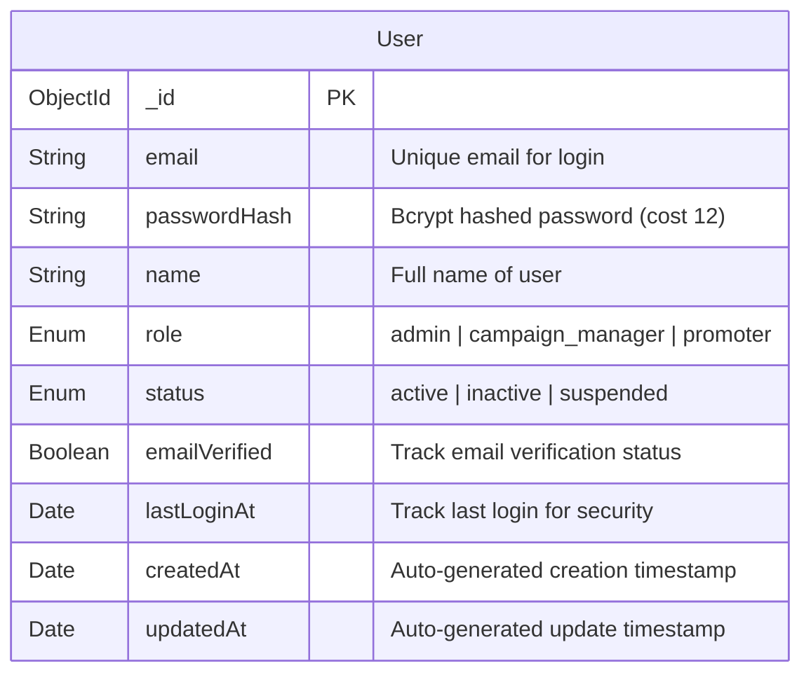
```mermaid
erDiagram
    User {
        ObjectId _id PK
        String email "Unique email for login"
        String passwordHash "Bcrypt hashed password (cost 12)"
        String name "Full name of user"
        Enum role "admin | campaign_manager | promoter"
        Enum status "active | inactive | suspended"
        Boolean emailVerified "Track email verification status"
        Date lastLoginAt "Track last login for security"
        Date createdAt "Auto-generated creation timestamp"
        Date updatedAt "Auto-generated update timestamp"
    }
```

**Table Description:**  
Stores all system users (admins, campaign managers, promoters). Single-tenant means all users belong to the same business. Role-based access control determines what each user can do.

**Purpose:** Authentication, authorization, user management  
**Relationships:** 
- User (1) → Session (N): One user can have multiple active sessions
- User (1) → Promoter (N): One user can be linked to promoter profile

---

## Session

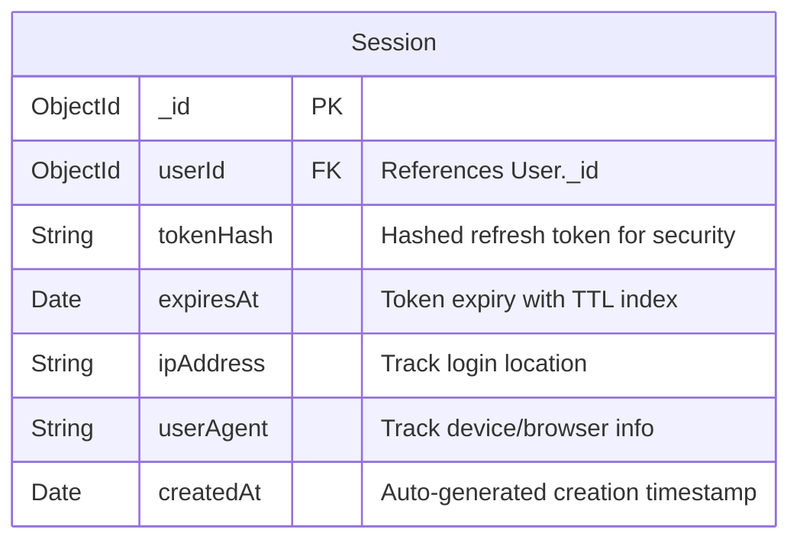
```mermaid
erDiagram
    Session {
        ObjectId _id PK
        ObjectId userId FK "References User._id"
        String tokenHash "Hashed refresh token for security"
        Date expiresAt "Token expiry with TTL index"
        String ipAddress "Track login location"
        String userAgent "Track device/browser info"
        Date createdAt "Auto-generated creation timestamp"
    }
```

**Table Description:**  
Manages user sessions for JWT refresh tokens. TTL index auto-cleans expired sessions. Token rotation on every refresh prevents token theft.

**Purpose:** Session management, refresh token storage, security  
**Relationships:**
- Session (N) → User (1): Multiple sessions per user
- TTL Index on expiresAt: Auto-cleanup after expiry

---

## LandingPage

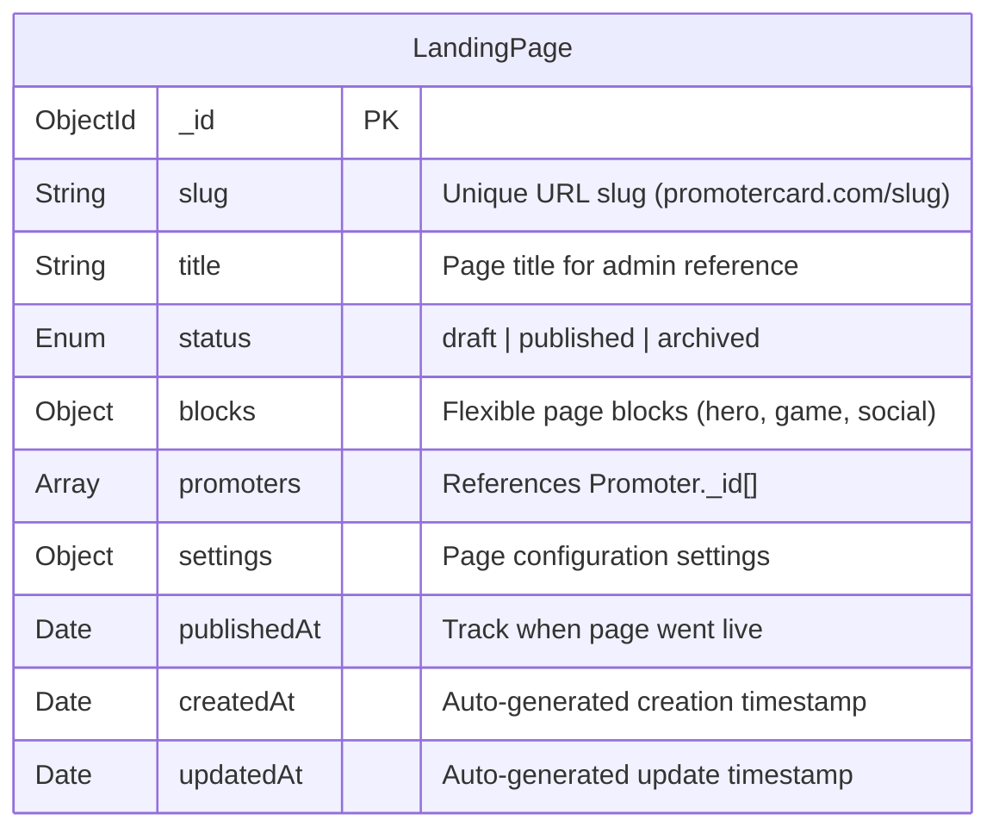
```mermaid
erDiagram
    LandingPage {
        ObjectId _id PK
        String slug "Unique URL slug (promotercard.com/slug)"
        String title "Page title for admin reference"
        Enum status "draft | published | archived"
        Object blocks "Flexible page blocks (hero, game, social)"
        Array promoters "References Promoter._id[]"
        Object settings "Page configuration settings"
        Date publishedAt "Track when page went live"
        Date createdAt "Auto-generated creation timestamp"
        Date updatedAt "Auto-generated update timestamp"
    }
```

**Table Description:**  
Core entity - every NFC card points to a landing page. Blocks are flexible (hero, event details, game, social links, contact info). Slug must be unique for URL routing.

**Purpose:** Event landing pages, customer engagement hub  
**Relationships:**
- LandingPage (1) → Campaign (N): Multiple campaigns can use same page
- LandingPage (1) → Card (N): Multiple cards can link to same page
- LandingPage (1) → Participant (N): Collects participants
- LandingPage (1) → GamePlay (N): Hosts game interactions
- LandingPage (1) → Prize (N): Offers prizes
- LandingPage (1) → ReviewClick (N): Tracks review clicks
- LandingPage (1) → SocialLink (N): Displays social links

---

## Promoter

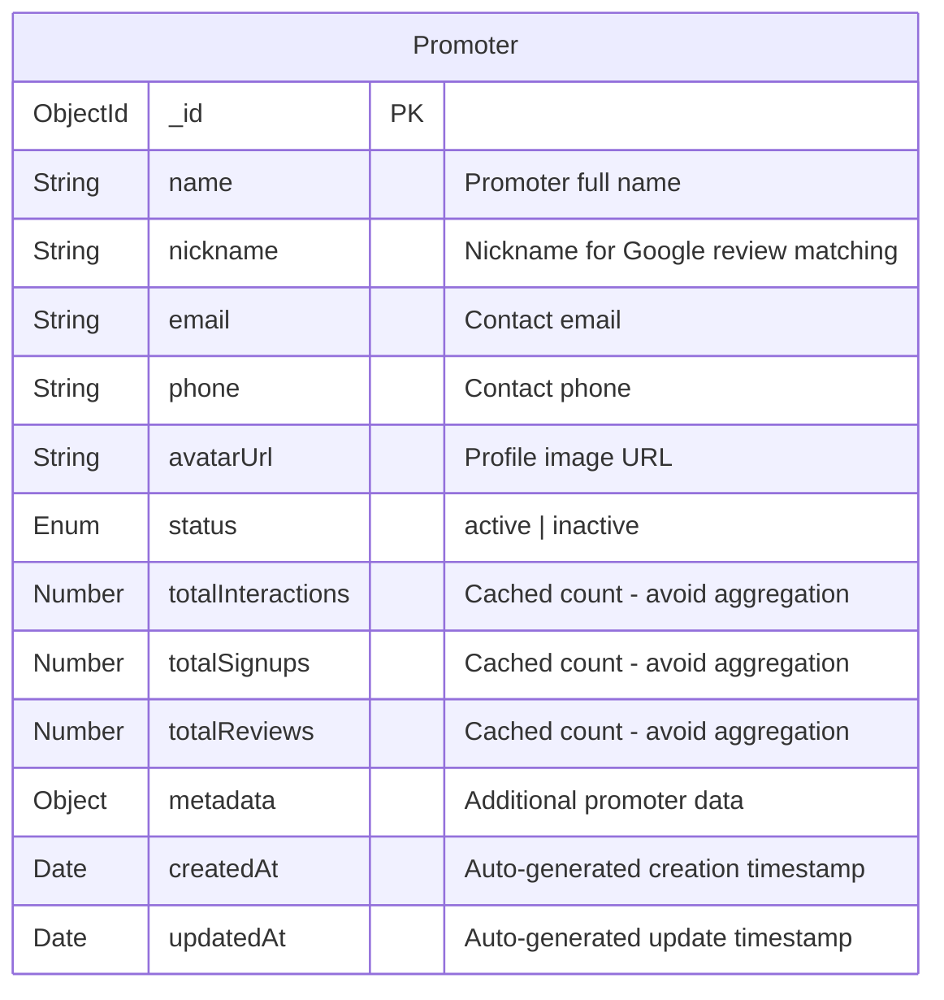
```mermaid
erDiagram
    Promoter {
        ObjectId _id PK
        String name "Promoter full name"
        String nickname "Nickname for Google review matching"
        String email "Contact email"
        String phone "Contact phone"
        String avatarUrl "Profile image URL"
        Enum status "active | inactive"
        Number totalInteractions "Cached count - avoid aggregation"
        Number totalSignups "Cached count - avoid aggregation"
        Number totalReviews "Cached count - avoid aggregation"
        Object metadata "Additional promoter data"
        Date createdAt "Auto-generated creation timestamp"
        Date updatedAt "Auto-generated update timestamp"
    }
```

**Table Description:**  
Field staff who distribute NFC cards. Nickname helps match promoter mentions in Google reviews. Cached counters avoid expensive aggregation queries for leaderboard.

**Purpose:** Promoter management, performance tracking, attribution  
**Relationships:**
- Promoter (N) → Card (1): Promoter assigned to cards
- Promoter (N) → PromoterSelection (1): Selections attributed to promoter
- Promoter (N) → ReviewClick (1): Reviews attributed to promoter
- Text Index on (name, nickname): Enable search

---

## PromoterSelection

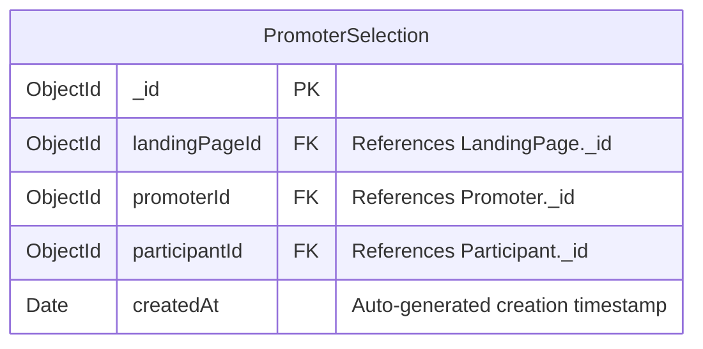
```mermaid
erDiagram
    PromoterSelection {
        ObjectId _id PK
        ObjectId landingPageId FK "References LandingPage._id"
        ObjectId promoterId FK "References Promoter._id"
        ObjectId participantId FK "References Participant._id"
        Date createdAt "Auto-generated creation timestamp"
    }
```

**Table Description:**  
Tracks which promoter a customer selected on landing page. Critical for promoter attribution and leaderboard. Links customer interaction to promoter performance.

**Purpose:** Promoter attribution, leaderboard calculation, performance tracking  
**Relationships:**
- PromoterSelection (N) → LandingPage (1): Selection on specific page
- PromoterSelection (N) → Promoter (1): Selection attributed to promoter
- PromoterSelection (N) → Participant (1): Selection by participant

---

## Campaign

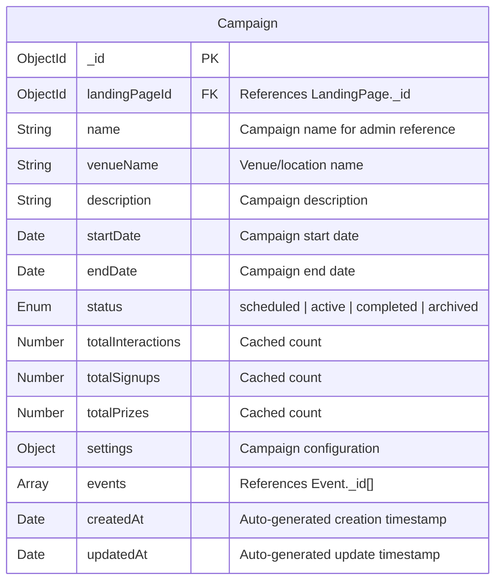
```mermaid
erDiagram
    Campaign {
        ObjectId _id PK
        ObjectId landingPageId FK "References LandingPage._id"
        String name "Campaign name for admin reference"
        String venueName "Venue/location name"
        String description "Campaign description"
        Date startDate "Campaign start date"
        Date endDate "Campaign end date"
        Enum status "scheduled | active | completed | archived"
        Number totalInteractions "Cached count"
        Number totalSignups "Cached count"
        Number totalPrizes "Cached count"
        Object settings "Campaign configuration"
        Array events "References Event._id[]"
        Date createdAt "Auto-generated creation timestamp"
        Date updatedAt "Auto-generated update timestamp"
    }
```

**Table Description:**  
Organizes promoters, cards, and events into campaigns. Status transitions: scheduled → active → completed. Cached counters for quick dashboard display.

**Purpose:** Campaign lifecycle management, progress tracking, reporting  
**Relationships:**
- Campaign (N) → LandingPage (1): Campaign uses landing page
- Campaign (1) → Event (N): Campaign contains events
- Campaign (1) → Participant (N): Campaign collects participants

---

## Event

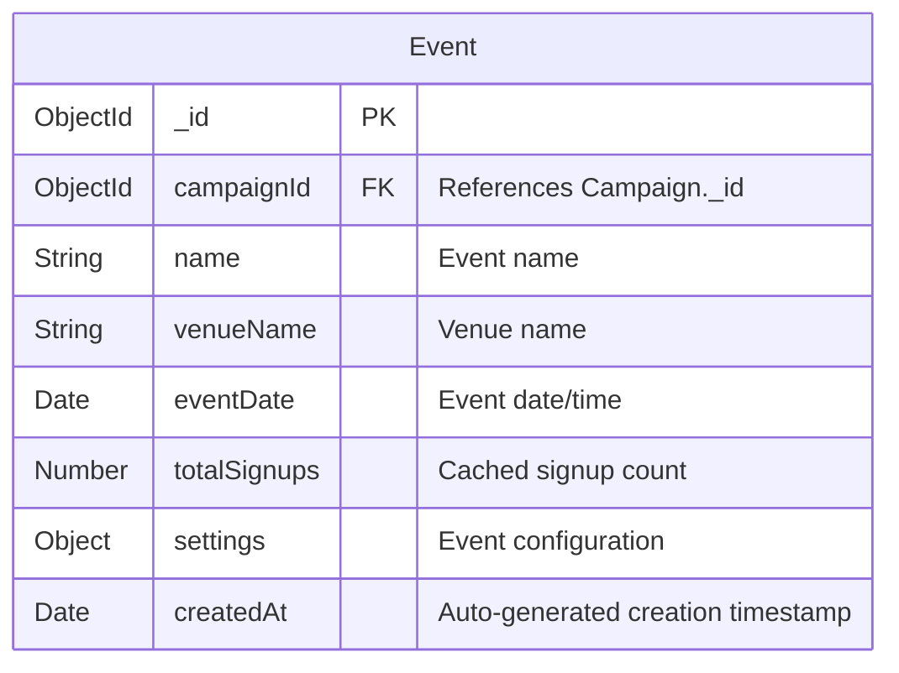
```mermaid
erDiagram
    Event {
        ObjectId _id PK
        ObjectId campaignId FK "References Campaign._id"
        String name "Event name"
        String venueName "Venue name"
        Date eventDate "Event date/time"
        Number totalSignups "Cached signup count"
        Object settings "Event configuration"
        Date createdAt "Auto-generated creation timestamp"
    }
```

**Table Description:**  
Specific event instances within a campaign. Each event has date, venue, signup count. Used for event tracking and promoter assignment.

**Purpose:** Event management, scheduling, tracking  
**Relationships:**
- Event (N) → Campaign (1): Event belongs to campaign

---

## Card

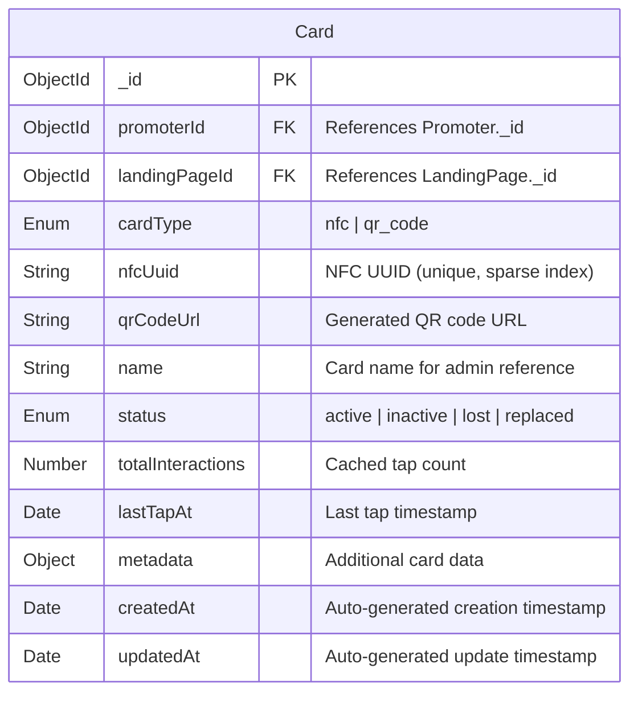
```mermaid
erDiagram
    Card {
        ObjectId _id PK
        ObjectId promoterId FK "References Promoter._id"
        ObjectId landingPageId FK "References LandingPage._id"
        Enum cardType "nfc | qr_code"
        String nfcUuid "NFC UUID (unique, sparse index)"
        String qrCodeUrl "Generated QR code URL"
        String name "Card name for admin reference"
        Enum status "active | inactive | lost | replaced"
        Number totalInteractions "Cached tap count"
        Date lastTapAt "Last tap timestamp"
        Object metadata "Additional card data"
        Date createdAt "Auto-generated creation timestamp"
        Date updatedAt "Auto-generated update timestamp"
    }
```

**Table Description:**  
Physical NFC cards or digital QR codes. NFC UUID resolves to landing page (critical path). Cached counters for quick stats. Status tracks card lifecycle.

**Purpose:** NFC/QR card management, tap tracking, assignment  
**Relationships:**
- Card (N) → Promoter (1): Card assigned to promoter
- Card (N) → LandingPage (1): Card links to landing page
- Card (1) → CardInteraction (N): Card records interactions
- Unique Index on nfcUuid: Critical for NFC resolution

---

## CardInteraction

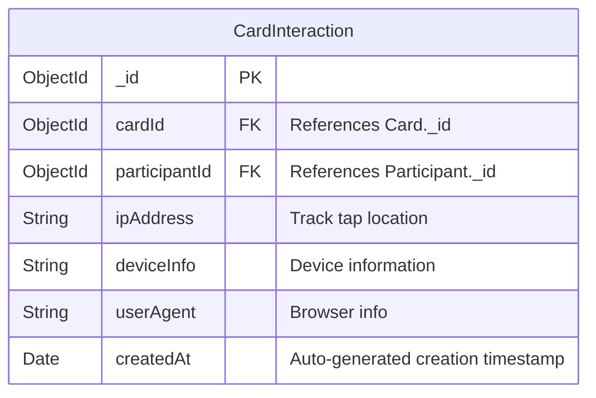
```mermaid
erDiagram
    CardInteraction {
        ObjectId _id PK
        ObjectId cardId FK "References Card._id"
        ObjectId participantId FK "References Participant._id"
        String ipAddress "Track tap location"
        String deviceInfo "Device information"
        String userAgent "Browser info"
        Date createdAt "Auto-generated creation timestamp"
    }
```

**Table Description:**  
Tracks every NFC tap or QR scan. Used for analytics, fraud detection, and promoter performance. High-volume collection - consider time-series optimization.

**Purpose:** Interaction tracking, analytics, fraud detection  
**Relationships:**
- CardInteraction (N) → Card (1): Interaction on specific card
- CardInteraction (N) → Participant (1): Interaction by participant

---

## Participant

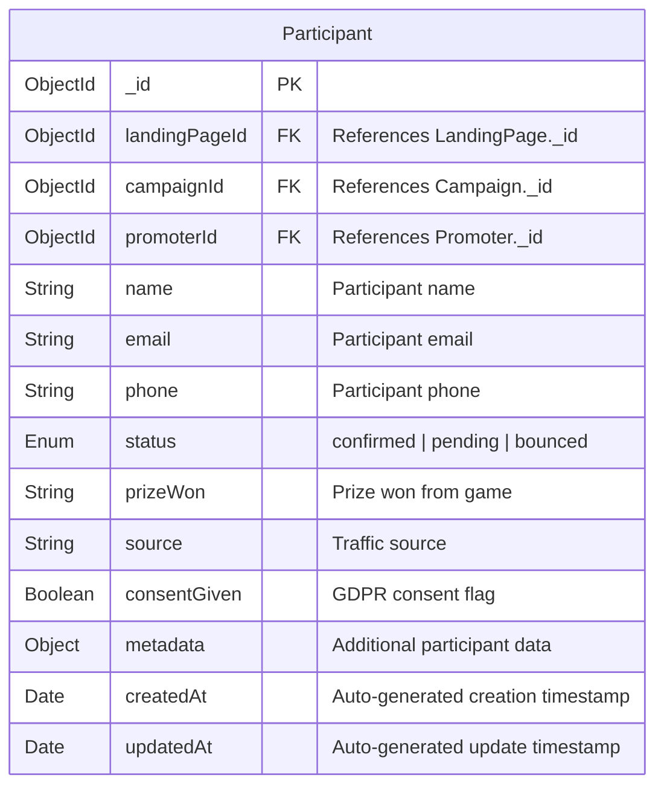
```mermaid
erDiagram
    Participant {
        ObjectId _id PK
        ObjectId landingPageId FK "References LandingPage._id"
        ObjectId campaignId FK "References Campaign._id"
        ObjectId promoterId FK "References Promoter._id"
        String name "Participant name"
        String email "Participant email"
        String phone "Participant phone"
        Enum status "confirmed | pending | bounced"
        String prizeWon "Prize won from game"
        String source "Traffic source"
        Boolean consentGiven "GDPR consent flag"
        Object metadata "Additional participant data"
        Date createdAt "Auto-generated creation timestamp"
        Date updatedAt "Auto-generated update timestamp"
    }
```

**Table Description:**  
Customer data captured from landing page sign-ups. GDPR compliance requires consent flag. Linked to landing page, campaign, and promoter for attribution.

**Purpose:** Lead capture, customer database, attribution  
**Relationships:**
- Participant (N) → LandingPage (1): Participant from landing page
- Participant (N) → Campaign (1): Participant from campaign
- Participant (N) → Promoter (1): Participant attributed to promoter
- Participant (1) → GamePlay (N): Participant plays games
- Participant (1) → ReviewClick (N): Participant clicks reviews
- Participant (1) → SocialLinkClick (N): Participant clicks social links
- Participant (1) → CardInteraction (N): Participant generates interactions
- Participant (1) → PromoterSelection (N): Participant selects promoter
- Unique Index on email: Prevent duplicate signups

---

## GamePlay

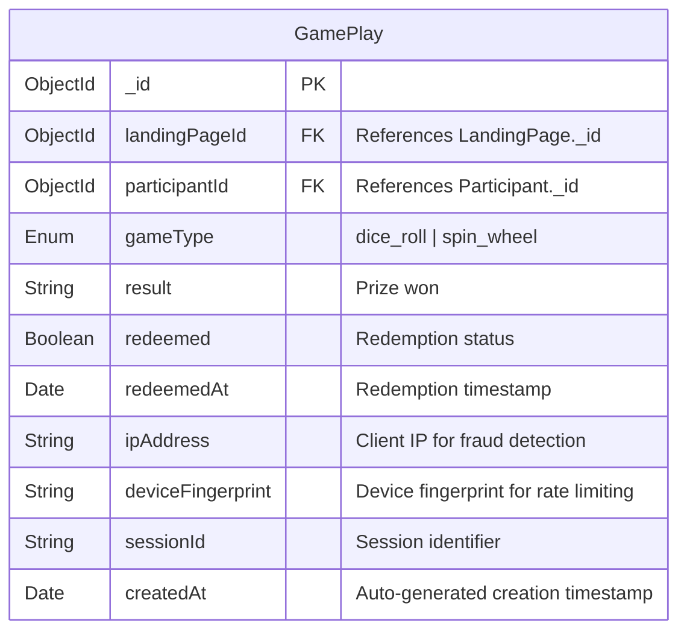
```mermaid
erDiagram
    GamePlay {
        ObjectId _id PK
        ObjectId landingPageId FK "References LandingPage._id"
        ObjectId participantId FK "References Participant._id"
        Enum gameType "dice_roll | spin_wheel"
        String result "Prize won"
        Boolean redeemed "Redemption status"
        Date redeemedAt "Redemption timestamp"
        String ipAddress "Client IP for fraud detection"
        String deviceFingerprint "Device fingerprint for rate limiting"
        String sessionId "Session identifier"
        Date createdAt "Auto-generated creation timestamp"
    }
```

**Table Description:**  
Records every game play. Device fingerprint prevents abuse (1 play per 5 min). Result stores prize won. Redemption tracking for prize fulfillment.

**Purpose:** Game interaction tracking, fraud prevention, prize tracking  
**Relationships:**
- GamePlay (N) → LandingPage (1): Game on landing page
- GamePlay (N) → Participant (1): Game played by participant
- Compound Index on (deviceFingerprint, createdAt): Fraud detection

---

## Prize

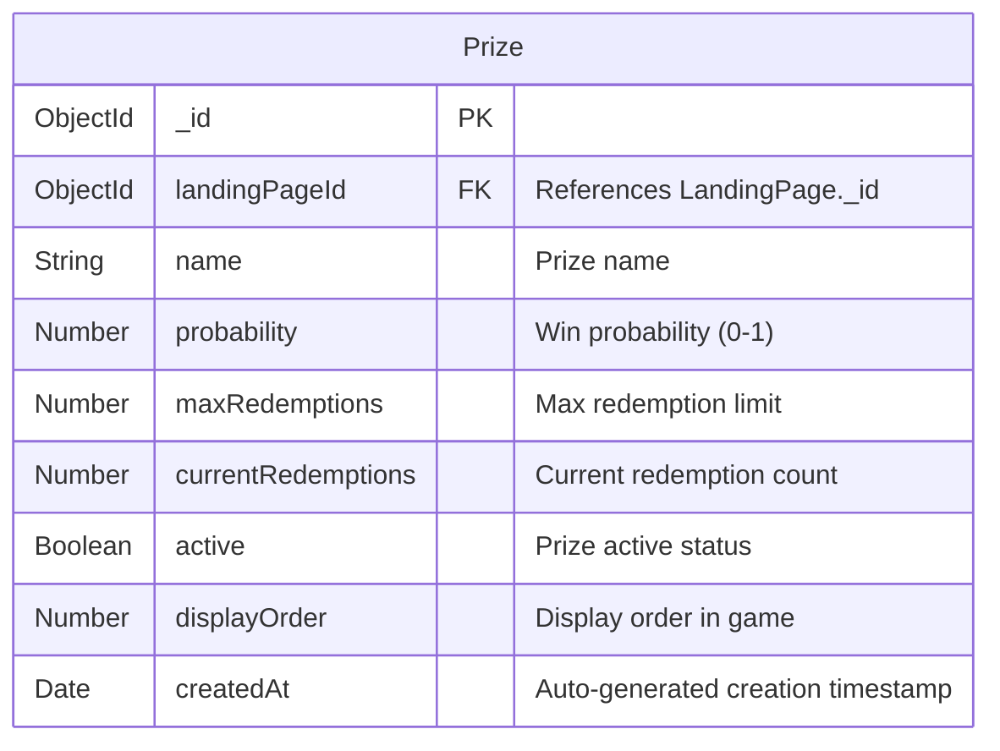
```mermaid
erDiagram
    Prize {
        ObjectId _id PK
        ObjectId landingPageId FK "References LandingPage._id"
        String name "Prize name"
        Number probability "Win probability (0-1)"
        Number maxRedemptions "Max redemption limit"
        Number currentRedemptions "Current redemption count"
        Boolean active "Prize active status"
        Number displayOrder "Display order in game"
        Date createdAt "Auto-generated creation timestamp"
    }
```

**Table Description:**  
Prizes offered on landing page games. Probability determines win rate. Max redemptions prevents unlimited prizes. Display order controls game UI.

**Purpose:** Prize configuration, probability management, redemption tracking  
**Relationships:**
- Prize (N) → LandingPage (1): Prize offered on landing page

---

## ReviewClick

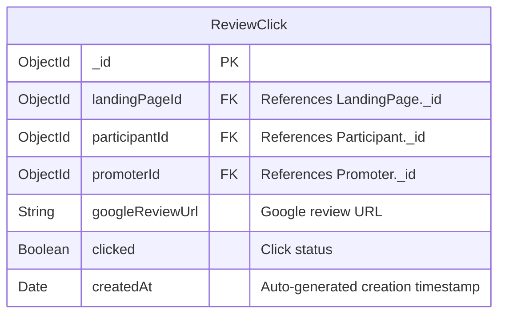
```mermaid
erDiagram
    ReviewClick {
        ObjectId _id PK
        ObjectId landingPageId FK "References LandingPage._id"
        ObjectId participantId FK "References Participant._id"
        ObjectId promoterId FK "References Promoter._id"
        String googleReviewUrl "Google review URL"
        Boolean clicked "Click status"
        Date createdAt "Auto-generated creation timestamp"
    }
```

**Table Description:**  
Tracks when customers click "Leave a Review" button. Google API doesn't allow tracking actual reviews, so clicks are proxy metric. Attributed to promoter for performance.

**Purpose:** Review tracking, promoter attribution, engagement metrics  
**Relationships:**
- ReviewClick (N) → LandingPage (1): Click on landing page
- ReviewClick (N) → Participant (1): Click by participant
- ReviewClick (N) → Promoter (1): Click attributed to promoter

---

## SocialLink

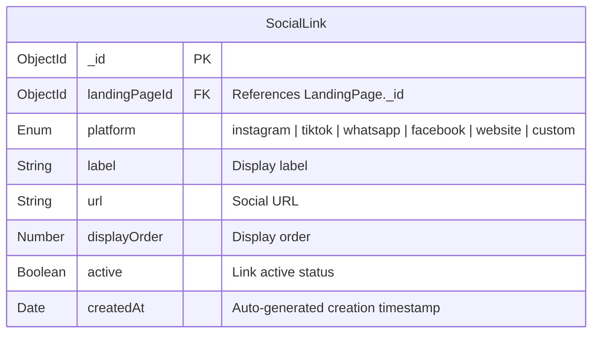
```mermaid
erDiagram
    SocialLink {
        ObjectId _id PK
        ObjectId landingPageId FK "References LandingPage._id"
        Enum platform "instagram | tiktok | whatsapp | facebook | website | custom"
        String label "Display label"
        String url "Social URL"
        Number displayOrder "Display order"
        Boolean active "Link active status"
        Date createdAt "Auto-generated creation timestamp"
    }
```

**Table Description:**  
Social media links displayed on landing pages. Platform enum for categorization. Click tracking for engagement analytics.

**Purpose:** Social media engagement, link tracking, analytics  
**Relationships:**
- SocialLink (N) → LandingPage (1): Link on landing page
- SocialLink (1) → SocialLinkClick (N): Link receives clicks

---

## SocialLinkClick

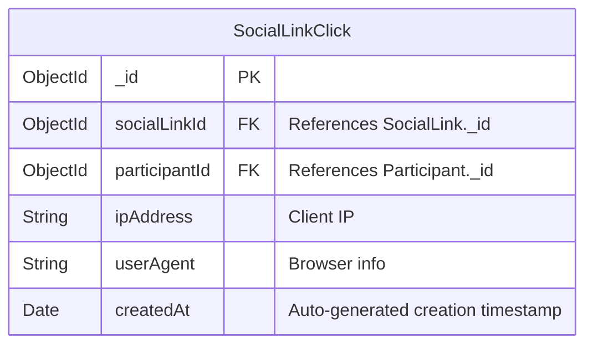
```mermaid
erDiagram
    SocialLinkClick {
        ObjectId _id PK
        ObjectId socialLinkId FK "References SocialLink._id"
        ObjectId participantId FK "References Participant._id"
        String ipAddress "Client IP"
        String userAgent "Browser info"
        Date createdAt "Auto-generated creation timestamp"
    }
```

**Table Description:**  
Tracks clicks on social links. Used for analytics to see which platforms drive most engagement. High-volume collection.

**Purpose:** Social engagement tracking, platform analytics  
**Relationships:**
- SocialLinkClick (N) → SocialLink (1): Click on social link
- SocialLinkClick (N) → Participant (1): Click by participant

---

## AnalyticsDaily

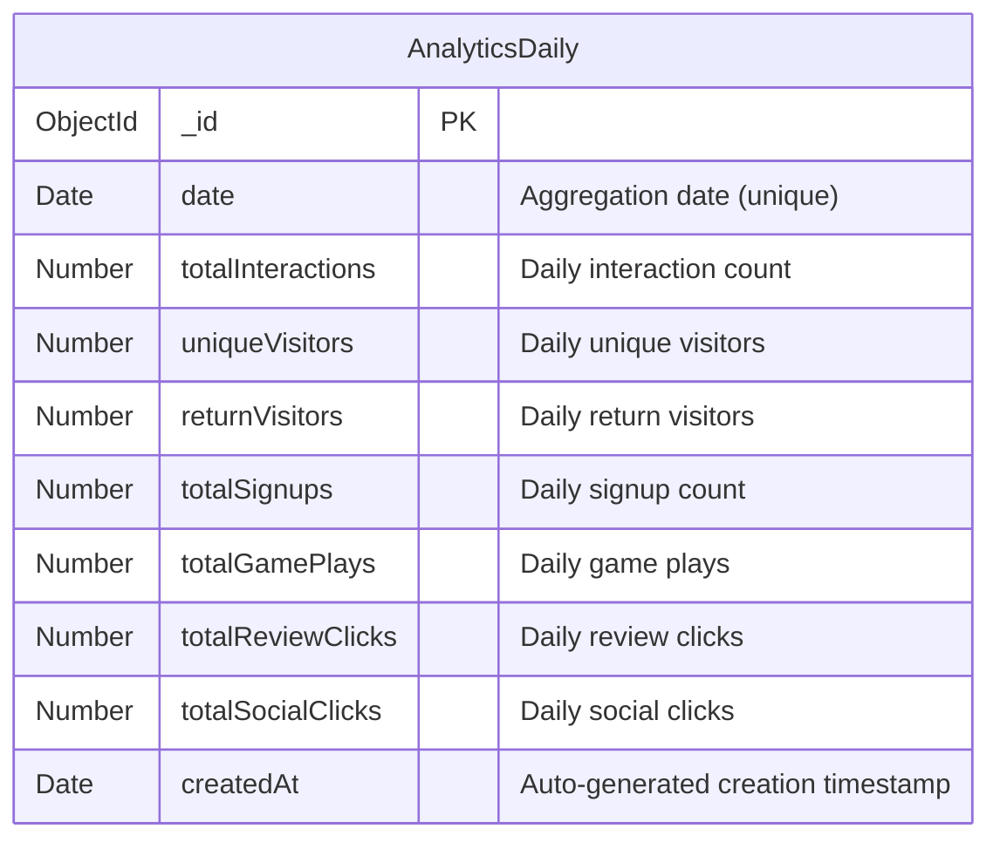
```mermaid
erDiagram
    AnalyticsDaily {
        ObjectId _id PK
        Date date "Aggregation date (unique)"
        Number totalInteractions "Daily interaction count"
        Number uniqueVisitors "Daily unique visitors"
        Number returnVisitors "Daily return visitors"
        Number totalSignups "Daily signup count"
        Number totalGamePlays "Daily game plays"
        Number totalReviewClicks "Daily review clicks"
        Number totalSocialClicks "Daily social clicks"
        Date createdAt "Auto-generated creation timestamp"
    }
```

**Table Description:**  
Pre-aggregated daily metrics for fast dashboard loading. Avoids expensive aggregation queries on raw data. Updated by scheduled BullMQ job at midnight.

**Purpose:** Fast analytics queries, dashboard performance, trend analysis  
**Relationships:**
- AnalyticsDaily is standalone (aggregated from other collections)
- Unique Index on date: One record per day

---

## Report

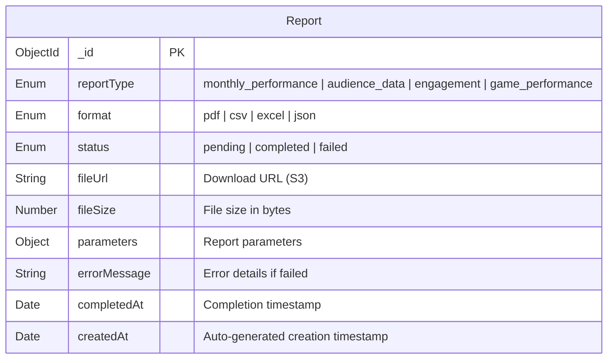
```mermaid
erDiagram
    Report {
        ObjectId _id PK
        Enum reportType "monthly_performance | audience_data | engagement | game_performance"
        Enum format "pdf | csv | excel | json"
        Enum status "pending | completed | failed"
        String fileUrl "Download URL (S3)"
        Number fileSize "File size in bytes"
        Object parameters "Report parameters"
        String errorMessage "Error details if failed"
        Date completedAt "Completion timestamp"
        Date createdAt "Auto-generated creation timestamp"
    }
```

**Table Description:**  
Tracks async report generation jobs. Status tracks lifecycle: pending → completed/failed. File stored in S3 after generation. BullMQ handles async processing.

**Purpose:** Report generation tracking, async job management, file storage  
**Relationships:**
- Report is standalone (generated from other collections)
- File stored in S3 (external)

---

## Complete Relationship Map

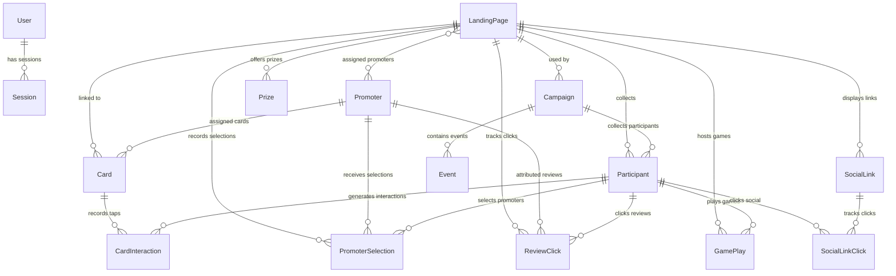
```mermaid
erDiagram
    User ||--o{ Session : "has sessions"
    LandingPage }o--o{ Promoter : "assigned promoters"
    LandingPage ||--o{ Campaign : "used by"
    LandingPage ||--o{ Card : "linked to"
    LandingPage ||--o{ Participant : "collects"
    LandingPage ||--o{ GamePlay : "hosts games"
    LandingPage ||--o{ Prize : "offers prizes"
    LandingPage ||--o{ ReviewClick : "tracks clicks"
    LandingPage ||--o{ SocialLink : "displays links"
    LandingPage ||--o{ PromoterSelection : "records selections"
    Promoter ||--o{ Card : "assigned cards"
    Promoter ||--o{ PromoterSelection : "receives selections"
    Promoter ||--o{ ReviewClick : "attributed reviews"
    Campaign ||--o{ Event : "contains events"
    Campaign ||--o{ Participant : "collects participants"
    Card ||--o{ CardInteraction : "records taps"
    Participant ||--o{ GamePlay : "plays games"
    Participant ||--o{ ReviewClick : "clicks reviews"
    Participant ||--o{ SocialLinkClick : "clicks social"
    Participant ||--o{ CardInteraction : "generates interactions"
    Participant ||--o{ PromoterSelection : "selects promoters"
    SocialLink ||--o{ SocialLinkClick : "tracks clicks"
```

---

## Index Strategy Summary

| Collection | Index | Type | Purpose |
|------------|-------|------|---------|
| User | `{ email: 1 }` | Unique | Login queries |
| User | `{ role: 1, status: 1 }` | Compound | Role filtering |
| LandingPage | `{ slug: 1 }` | Unique | URL routing |
| LandingPage | `{ status: 1, publishedAt: -1 }` | Compound | Page listing |
| Promoter | `{ totalInteractions: -1 }` | Single | Leaderboard |
| Promoter | `{ status: 1 }` | Single | Status filtering |
| Promoter | `{ name: 'text', nickname: 'text' }` | Text | Search |
| Campaign | `{ status: 1, startDate: 1, endDate: 1 }` | Compound | Date queries |
| Event | `{ campaignId: 1, eventDate: 1 }` | Compound | Event listing |
| Participant | `{ landingPageId: 1, createdAt: -1 }` | Compound | Participant list |
| Participant | `{ email: 1 }` | Unique | Duplicate check |
| Card | `{ nfcUuid: 1 }` | Unique, Sparse | NFC resolution |
| Card | `{ promoterId: 1, status: 1 }` | Compound | Promoter cards |
| CardInteraction | `{ cardId: 1, createdAt: -1 }` | Compound | Card analytics |
| GamePlay | `{ deviceFingerprint: 1, createdAt: -1 }` | Compound | Fraud detection |
| Prize | `{ landingPageId: 1, active: 1, displayOrder: 1 }` | Compound | Prize listing |
| ReviewClick | `{ landingPageId: 1, createdAt: -1 }` | Compound | Review analytics |
| SocialLink | `{ landingPageId: 1, displayOrder: 1 }` | Compound | Link ordering |
| AnalyticsDaily | `{ date: -1 }` | Unique | Daily trends |
| Session | `{ expiresAt: 1 }` | TTL | Auto-cleanup |

---

## Design Principles

### Single-Tenant Architecture
- No `businessId` field on any collection
- Single business per deployment
- Simplified authorization

### Referencing Strategy
- All relationships use ObjectId references
- No embedded documents (except blocks/settings)
- Maximum 2 levels of `$lookup` chains

### Cached Counters
- `totalInteractions`, `totalSignups`, `totalReviews` cached on Promoter
- Avoids expensive aggregation queries
- Updated incrementally on each action

### Flexible Schema
- `blocks` field uses Mixed type for dynamic content
- `settings` and `metadata` fields for extensibility
- No schema migrations needed for new fields

### Security Features
- Password hashed with bcrypt (cost 12)
- Session TTL auto-cleanup
- Device fingerprinting for fraud prevention
- GDPR consent tracking on Participant

---

**Document Version:** 1.0  
**Last Updated:** April 7, 2026  
**Status:** Ready for Implementation  
**Based On:** Product Requirements Document v3 (PRD)
