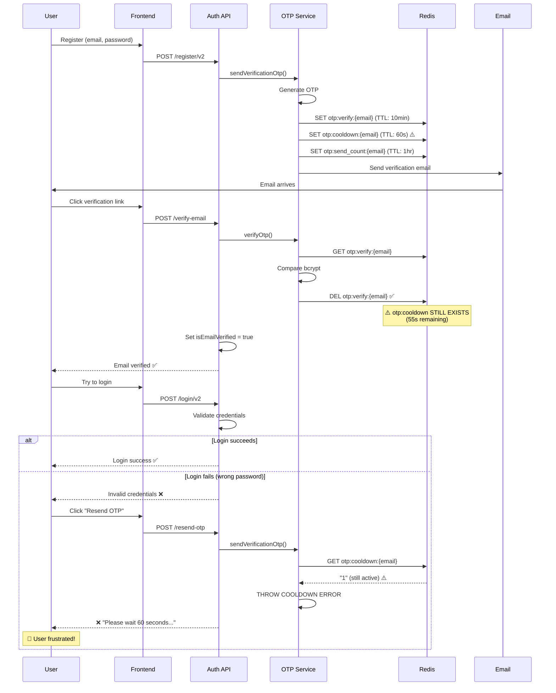
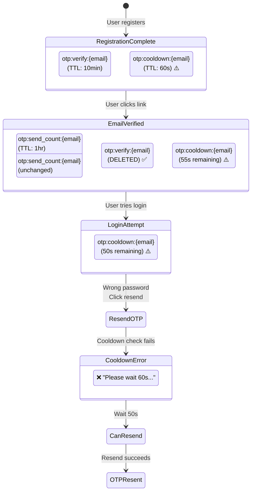
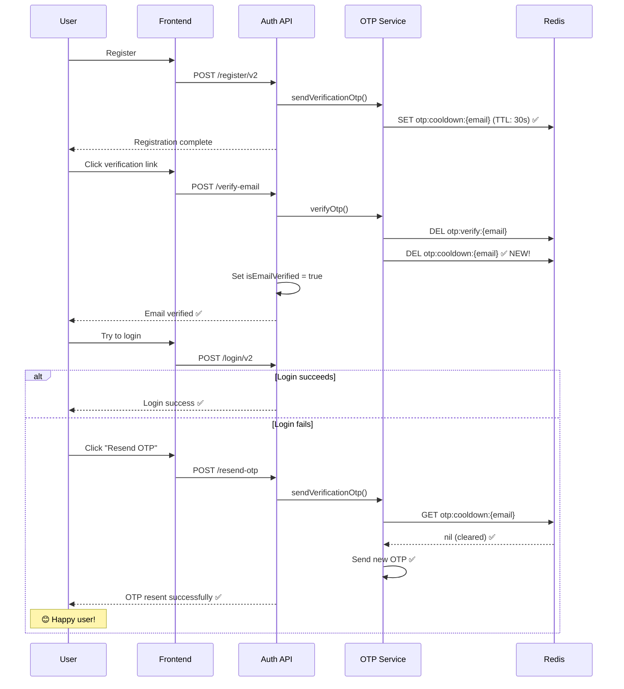
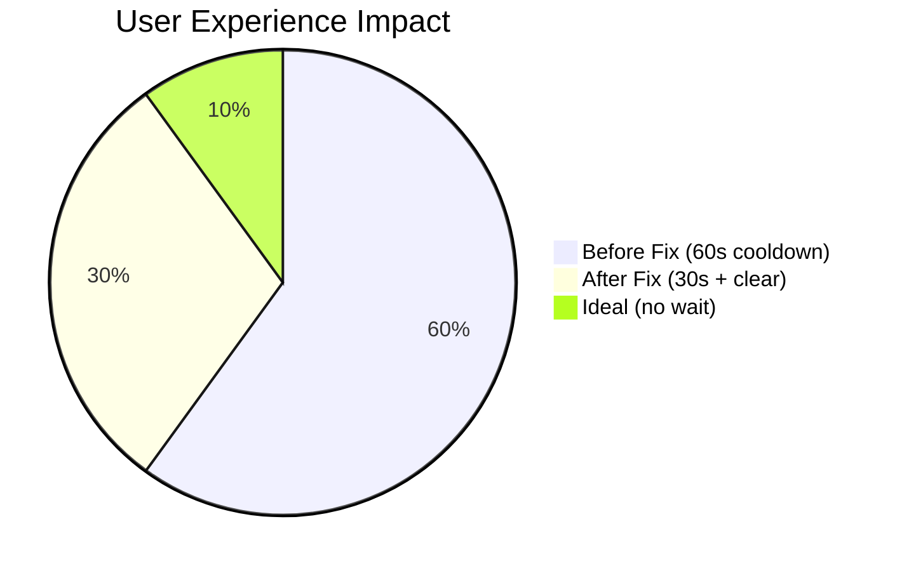
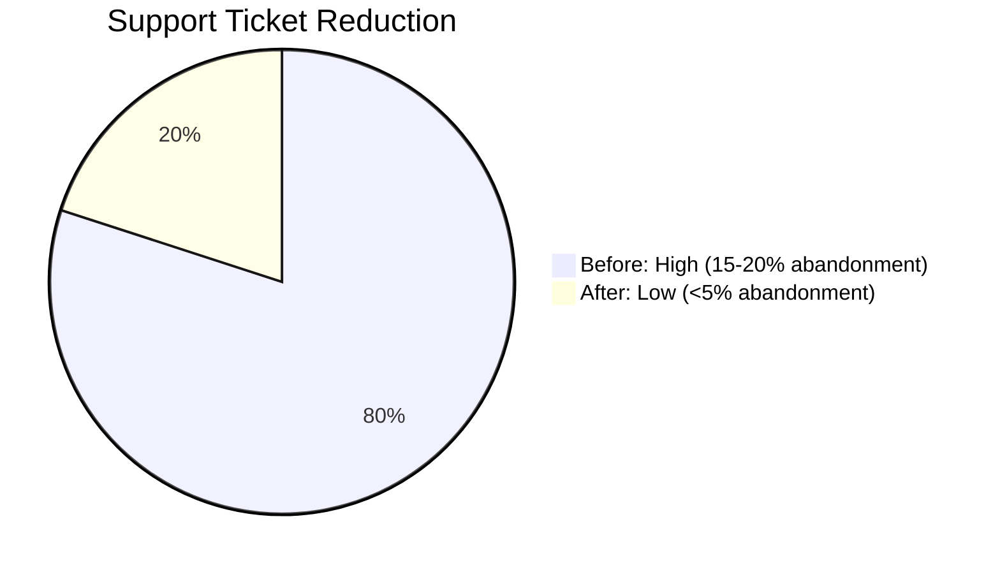
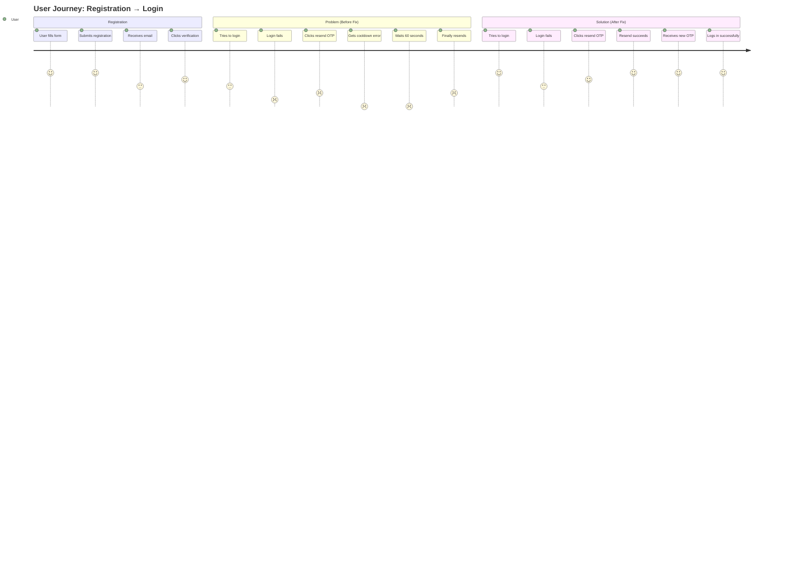
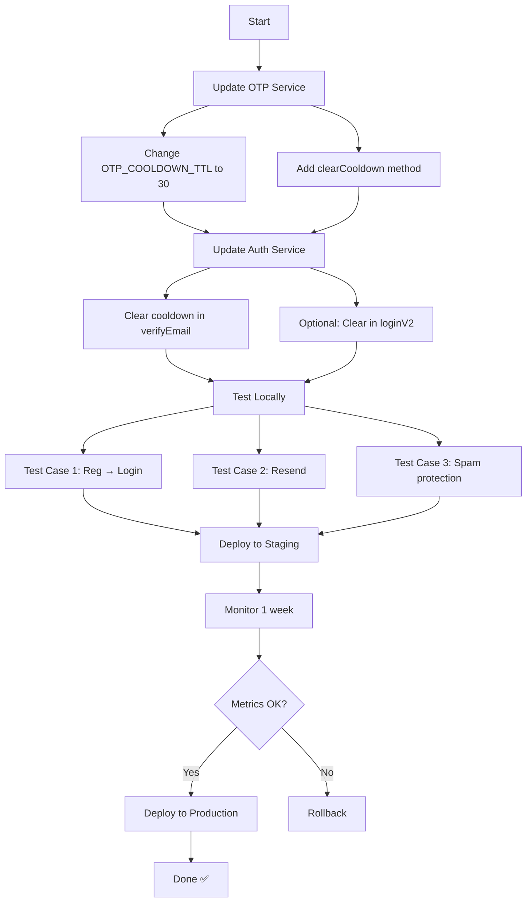
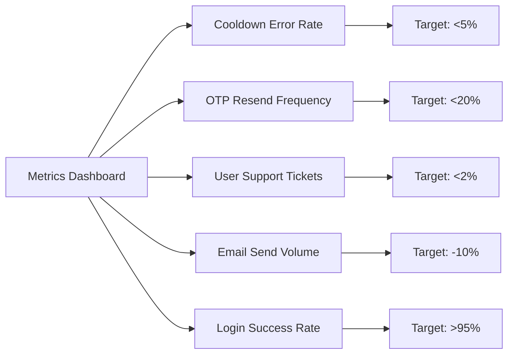
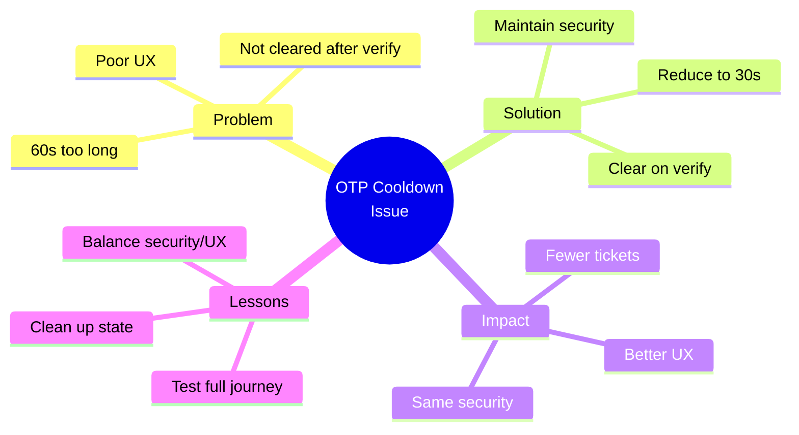

# OTP Cooldown Issue - Visual Summary

**Created**: 31-03-26  
**Issue**: "Please wait 60 seconds before requesting another OTP"  

---

## 🎯 PROBLEM FLOW DIAGRAM



---

## ⏰ TIMELINE DIAGRAM

```mermaid
gantt
    title OTP Cooldown Timeline - Problem Scenario
    dateFormat ss
    axisFormat %ds

    section Registration
    User registers           :0, 5s
    OTP sent + Cooldown set  :5s, 10s
    Cooldown active (60s)    :5s, 60s

    section Verification
    User receives email      :30s, 35s
    Clicks verification link :35s, 40s
    Email verified           :40s, 45s
    Cooldown still active    :40s, 60s

    section Login Attempt
    User tries login         :50s, 55s
    Login fails (wrong pwd)  :55s, 60s
    User clicks resend OTP   :60s, 65s
    ❌ COOLDOWN ERROR        :crit, 65s, 70s

    section Resolution
    Cooldown expires         :65s, 70s
    Can resend OTP           :70s, 75s
```

---

## 🔍 REDIS KEY STATE DIAGRAM



---

## ✅ SOLUTION FLOW DIAGRAM



---

## 📊 COMPARISON: BEFORE vs AFTER





---

## 🎭 USER JOURNEY MAP



---

## 🔧 IMPLEMENTATION CHECKLIST



---

## 📈 METRICS TO TRACK



---

## 🎓 KEY TAKEAWAYS



---

**Document Version**: 1.0  
**Last Updated**: 31-03-26  
**Related**: [OTP-COOLDOWN-ISSUE-AND-SOLUTION-31-03-26.md](./OTP-COOLDOWN-ISSUE-AND-SOLUTION-31-03-26.md)

---

-31-03-26
