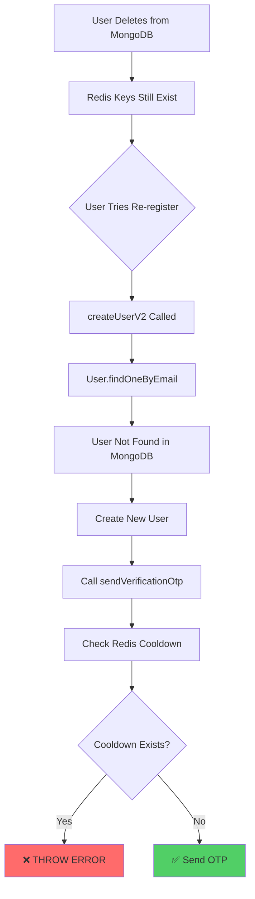

# OTP Stale Data Issue - Re-registration After Manual Delete

**Issue ID**: AUTH-OTP-002  
**Created**: 31-03-26  
**Status**: ⚠️ CRITICAL - Blocks re-registration  
**Severity**: HIGH - User cannot register after database cleanup  

---

## 🎯 EXECUTIVE SUMMARY

### The Problem
When you manually delete a user from MongoDB and try to re-register with the same email, you get:
```
"Please wait 10 seconds before requesting another OTP"
```

**Root Cause**: Redis OTP keys from the previous registration still exist even though the user was deleted from MongoDB.

### Why This Happens
```
Registration Flow:
1. User registers → MongoDB user created + Redis OTP keys set
2. Admin deletes user from MongoDB (manual cleanup)
3. Redis OTP keys NOT deleted → Still active with cooldown
4. User tries to re-register → Cooldown blocks new OTP
```

**Missing Step**: Redis cleanup when deleting users from database.

---

## 📋 TABLE OF CONTENTS

1. [Issue Reproduction](#issue-reproduction)
2. [Technical Analysis](#technical-analysis)
3. [Redis Keys That Persist](#redis-keys-that-persist)
4. [Impact Analysis](#impact-analysis)
5. [Solutions](#solutions)
6. [Implementation Guide](#implementation-guide)
7. [Testing Checklist](#testing-checklist)

---

## 🔬 ISSUE REPRODUCTION

### Step-by-Step Reproduction

```
Step 1: Initial Registration
  POST /api/v1/register/v2
  Body: { email: "test@example.com", password, name, role }
  
  Backend Creates:
  ✅ MongoDB: User document
  ✅ MongoDB: UserProfile document
  ✅ Redis: otp:verify:test@example.com (TTL: 10 min)
  ✅ Redis: otp:cooldown:test@example.com (TTL: 60s → now 30s)
  ✅ Redis: otp:send_count:test@example.com (TTL: 1 hour)
  ✅ Redis: session:test@example.com:* (if logged in)
  ✅ Redis: blacklist:* (if any tokens blacklisted)

Step 2: Manual Database Cleanup
  MongoDB Command:
  db.users.deleteOne({ email: "test@example.com" })
  db.userprofiles.deleteOne({ email: "test@example.com" })
  
  ⚠️ Redis Keys: NOT DELETED → Still exist!
  
  Redis State After Delete:
  ⚠️ otp:cooldown:test@example.com (45s remaining)
  ⚠️ otp:send_count:test@example.com (55 min remaining)
  ⚠️ Any other Redis keys still active

Step 3: Try to Re-register
  POST /api/v1/register/v2
  Body: { email: "test@example.com", password, name, role }
  
  Backend Flow:
  1. Check MongoDB: User not found ✅
  2. Create new user in MongoDB ✅
  3. Call otpService.sendVerificationOtp()
  4. Check Redis: otp:cooldown exists! ⚠️
  5. ❌ THROW ERROR: "Please wait 45 seconds..."
  
  Result: User CANNOT register!
```

---

## 🔍 TECHNICAL ANALYSIS

### What Happens in createUserV2()

**File**: `src/modules/auth/auth.service.ts`  
**Line**: 170-210

```typescript
const createUserV2 = async (userData: ICreateUser, userProfileId:string) => {

  const existingUser = await User.findOne({ email: userData.email });

  if (existingUser) {
    // Case 1: User exists in MongoDB
    if (existingUser.isEmailVerified) {
      throw new ApiError(StatusCodes.BAD_REQUEST, 'Email already taken');
    } else {
      // Update existing user
      await User.findOneAndUpdate({ email: userData.email }, userData);
      const verificationToken = await TokenService.createVerifyEmailToken(existingUser);
      await otpService.sendVerificationOtp(existingUser.email); // ⚠️ May fail due to cooldown
      return { verificationToken };
    }
  }

  // Case 2: User DOES NOT exist in MongoDB (our scenario)
  userData.password = await bcryptjs.hash(userData.password, 12);
  const user = await User.create(userData);

  // ✅ Create verification token and OTP in parallel
  const [verificationToken] = await Promise.all([
    TokenService.createVerifyEmailToken(user),
    otpService.sendVerificationOtp(user.email) // ⚠️ LINE 207 - FAILS HERE
  ]);

  return { user, verificationToken };
};
```

### The Problem Flow



---

## 🔑 REDIS KEYS THAT PERSIST

### OTP-Related Keys

```typescript
// 1. Verification OTP (may or may not exist)
Key: otp:verify:{email}
TTL: 10 minutes
Value: { hash: string, attempts: number }
Status: ⚠️ May persist if user didn't verify

// 2. Cooldown Flag (ALWAYS EXISTS after registration)
Key: otp:cooldown:{email}
TTL: 60 seconds (or 30s after fix)
Value: '1'
Status: ⚠️ ALWAYS persists - THIS IS THE PROBLEM

// 3. Send Counter (ALWAYS EXISTS after registration)
Key: otp:send_count:{email}
TTL: 1 hour
Value: number (usually 1)
Status: ⚠️ Persists - affects hourly limit

// 4. Reset Password OTP (if user requested password reset)
Key: otp:reset:{email}
TTL: 10 minutes
Status: ⚠️ May persist
```

### Session-Related Keys (if user logged in before delete)

```typescript
// 5. User Session Cache
Key: session:{userId}:{fcmToken}
TTL: 7 days
Status: ⚠️ Orphaned after user delete

// 6. Blacklisted Tokens
Key: blacklist:{refreshToken}
TTL: varies
Status: ⚠️ Orphaned after user delete
```

### Other Potential Keys

```typescript
// 7. Rate Limiting Keys (if any)
Key: ratelimit:{userId}:{endpoint}
Status: ⚠️ May persist

// 8. Cache Keys (if user data was cached)
Key: user:{userId}:profile
Status: ⚠️ Orphaned after user delete
```

---

## 💥 IMPACT ANALYSIS

### Scenario 1: Development/Testing

```
Impact: HIGH
Frequency: Common (developers delete users for testing)
User Impact: 0 (internal only)
Developer Frustration: HIGH

Example:
- Developer tests registration flow
- Deletes user from DB to re-test
- Cannot re-register → Blocked for 60s
- Must wait or use different email
- Productivity loss: 1-2 minutes per test
```

### Scenario 2: Production - Admin Cleanup

```
Impact: CRITICAL
Frequency: Rare (admin deletes problematic users)
User Impact: 100% (user cannot re-register)
Business Impact: Lost customers

Example:
- Admin deletes user (fraud, violation, etc.)
- User tries to create new account
- Blocked by stale Redis data
- User abandons platform
- Customer support ticket created
```

### Scenario 3: Production - User Self-Delete

```
Impact: CRITICAL
Frequency: Medium (users delete & re-create)
User Impact: 100% (cannot re-register)
Business Impact: Lost customers + Support costs

Example:
- User deletes account (GDPR, personal choice)
- User changes mind, tries to re-register
- Blocked by own stale Redis data
- User thinks platform is broken
- Negative reviews, churn
```

---

## ✅ SOLUTIONS

### Solution 1: Clear Redis Keys on User Delete (RECOMMENDED)

**Approach**: Add Redis cleanup to user deletion logic.

**Pros**:
- ✅ Solves the root cause
- ✅ Clean Redis state
- ✅ Prevents orphaned data
- ✅ Works for all scenarios

**Cons**:
- ⚠️ Requires finding all deletion points
- ⚠️ One more Redis operation

**Implementation**:
```typescript
// Add to user deletion service/controller
await cleanupUserRedisData(user._id, user.email);
```

---

### Solution 2: Clear Redis Keys Before Registration (DEFENSIVE)

**Approach**: Clear any existing Redis OTP data before sending new OTP.

**Pros**:
- ✅ Simple, centralized
- ✅ Handles all edge cases
- ✅ No need to find deletion points

**Cons**:
- ⚠️ Hides the real problem
- ⚠️ Slightly slower registration (extra Redis call)
- ⚠️ May mask other issues

**Implementation**:
```typescript
// In createUserV2(), before sending OTP
await otpService.clearAllOtpData(user.email);
await otpService.sendVerificationOtp(user.email);
```

---

### Solution 3: Hybrid Approach (BEST)

**Approach**: Implement BOTH Solution 1 AND Solution 2.

**Why Both**:
1. **Solution 1**: Clean deletion (proper architecture)
2. **Solution 2**: Defense-in-depth (handles edge cases)

**Example Edge Cases Covered**:
- Redis keys from crashed registration flow
- Manual MongoDB edits (direct DB manipulation)
- Database restore from backup
- Replication lag in MongoDB

---

## 🛠️ IMPLEMENTATION GUIDE

### Step 1: Add Redis Cleanup Method to OTP Service

**File**: `src/modules/otp/otp-v2.service.ts`

```typescript
/**
 * Clear ALL OTP-related Redis keys for an email
 * Use this when deleting a user or before re-registration
 *
 * @param email - User's email address
 */
async clearAllOtpData(email: string): Promise<void> {
  const lowerEmail = email.toLowerCase().trim();
  
  const keys = [
    `otp:verify:${lowerEmail}`,
    `otp:reset:${lowerEmail}`,
    `otp:cooldown:${lowerEmail}`,
    `otp:send_count:${lowerEmail}`,
  ];

  await redisClient.del(keys);
  logger.info(`All OTP data cleared for ${lowerEmail}`);
}

/**
 * Clear cooldown only (for successful verification)
 */
async clearCooldown(email: string): Promise<void> {
  const lowerEmail = email.toLowerCase().trim();
  await redisClient.del(`otp:cooldown:${lowerEmail}`);
  logger.info(`Cooldown cleared for ${lowerEmail}`);
}
```

---

### Step 2: Add User Redis Cleanup Utility

**File**: `src/modules/auth/auth.service.ts` (or create new utility file)

```typescript
/**
 * Clean up ALL Redis data for a user
 * Call this when deleting a user from database
 *
 * @param userId - User's MongoDB ID
 * @param email - User's email address
 */
async function cleanupUserRedisData(
  userId: string,
  email: string
): Promise<void> {
  try {
    const lowerEmail = email.toLowerCase().trim();
    
    // 1. Clear OTP data
    await otpService.clearAllOtpData(lowerEmail);
    
    // 2. Clear session data
    const sessionPattern = `session:${userId}:*`;
    const sessionKeys = await redisClient.keys(sessionPattern);
    if (sessionKeys.length > 0) {
      await redisClient.del(sessionKeys);
      logger.info(`Sessions cleared for user ${userId}`);
    }
    
    // 3. Clear user cache (if any)
    const userCacheKey = `user:${userId}:profile`;
    await redisClient.del(userCacheKey);
    
    // 4. Clear rate limit keys (if any)
    const rateLimitPattern = `ratelimit:${userId}:*`;
    const rateLimitKeys = await redisClient.keys(rateLimitPattern);
    if (rateLimitKeys.length > 0) {
      await redisClient.del(rateLimitKeys);
      logger.info(`Rate limit keys cleared for user ${userId}`);
    }
    
    logger.info(`Redis cleanup completed for user ${userId} (${lowerEmail})`);
  } catch (error) {
    errorLogger.error('Redis cleanup error:', error);
    // Don't throw - cleanup failure shouldn't block user deletion
  }
}
```

---

### Step 3: Find and Update All User Deletion Points

**Search for user deletion in codebase**:

```bash
# Find all user deletion patterns
grep -r "User.delete" src/
grep -r "User.findOneAndDelete" src/
grep -r "User.findByIdAndUpdate.*isDeleted" src/
```

**Common Deletion Points**:

```typescript
// 1. Soft Delete (isDeleted = true)
// File: src/modules/user.module/user.service.ts
const deleteUser = async (userId: string) => {
  const user = await User.findByIdAndUpdate(
    userId,
    { isDeleted: true },
    { new: true }
  );
  
  // ✅ Add Redis cleanup
  await cleanupUserRedisData(user._id, user.email);
  
  return user;
};

// 2. Hard Delete (permanent removal)
// File: src/modules/user.module/user.service.ts
const hardDeleteUser = async (userId: string) => {
  const user = await User.findById(userId);
  if (!user) {
    throw new ApiError(StatusCodes.NOT_FOUND, 'User not found');
  }
  
  // ✅ Add Redis cleanup BEFORE MongoDB delete
  await cleanupUserRedisData(user._id, user.email);
  
  await User.findByIdAndDelete(userId);
  await UserProfile.findByIdAndDelete(user.profileId);
  
  return { success: true };
};

// 3. Admin Delete (admin panel)
// File: src/modules/admin/admin.controller.ts
const adminDeleteUser = async (userId: string) => {
  const user = await User.findById(userId);
  
  // ✅ Add Redis cleanup
  await cleanupUserRedisData(user._id, user.email);
  
  await User.findByIdAndDelete(userId);
  // ... other cleanup
};
```

---

### Step 4: Add Defensive Cleanup in Registration

**File**: `src/modules/auth/auth.service.ts`  
**Line**: 170-210 (createUserV2 function)

```typescript
const createUserV2 = async (userData: ICreateUser, userProfileId:string) => {

  const existingUser = await User.findOne({ email: userData.email });

  if (existingUser) {
    if (existingUser.isEmailVerified) {
      throw new ApiError(StatusCodes.BAD_REQUEST, 'Email already taken');
    } else {
      await User.findOneAndUpdate({ email: userData.email }, userData);
      
      const verificationToken = await TokenService.createVerifyEmailToken(existingUser);
      
      // 🆕 DEFENSIVE: Clear stale OTP data before sending new OTP
      await otpService.clearAllOtpData(existingUser.email);
      
      await otpService.sendVerificationOtp(existingUser.email);
      return { verificationToken };
    }
  }

  userData.password = await bcryptjs.hash(userData.password, 12);
  const user = await User.create(userData);

  // 🆕 DEFENSIVE: Clear any stale OTP data before sending new OTP
  await otpService.clearAllOtpData(user.email);

  const [verificationToken] = await Promise.all([
    TokenService.createVerifyEmailToken(user),
    otpService.sendVerificationOtp(user.email)
  ]);

  return { user, verificationToken };
};
```

---

### Step 5: Create Manual Cleanup Script (Emergency Use)

**File**: `src/scripts/cleanup-stale-otp.ts`

```typescript
/**
 * Emergency script to clean up stale OTP data
 * Run manually when users report registration issues
 *
 * Usage: npm run cleanup-otp -- email@example.com
 */

import { redisClient } from '../helpers/redis/redis';

async function cleanupStaleOtp(email: string) {
  try {
    const lowerEmail = email.toLowerCase().trim();
    
    const keys = [
      `otp:verify:${lowerEmail}`,
      `otp:reset:${lowerEmail}`,
      `otp:cooldown:${lowerEmail}`,
      `otp:send_count:${lowerEmail}`,
    ];
    
    const deleted = await redisClient.del(keys);
    console.log(`✅ Cleaned up ${deleted} Redis keys for ${email}`);
    
    process.exit(0);
  } catch (error) {
    console.error('❌ Cleanup failed:', error);
    process.exit(1);
  }
}

const email = process.argv[2];
if (!email) {
  console.error('Usage: npm run cleanup-otp -- email@example.com');
  process.exit(1);
}

cleanupStaleOtp(email);
```

**Add to package.json**:
```json
{
  "scripts": {
    "cleanup-otp": "ts-node src/scripts/cleanup-stale-otp.ts"
  }
}
```

---

## 🧪 TESTING CHECKLIST

### Manual Testing

```
✅ Test Case 1: Register → Delete → Re-register (Immediate)
  1. Register user: test@example.com
  2. Delete user from MongoDB manually
  3. Immediately re-register: test@example.com
  4. Expected: Registration succeeds, OTP sent ✅

✅ Test Case 2: Register → Verify → Delete → Re-register
  1. Register user: test@example.com
  2. Verify email
  3. Delete user from MongoDB
  4. Re-register: test@example.com
  5. Expected: Registration succeeds, OTP sent ✅

✅ Test Case 3: Register → Login → Delete → Re-register
  1. Register user: test@example.com
  2. Verify email, login
  3. Delete user from MongoDB
  4. Re-register: test@example.com
  5. Expected: Registration succeeds, OTP sent ✅

✅ Test Case 4: Multiple Rapid Re-registrations
  1. Register → Delete → Re-register (x5 times)
  2. Expected: All succeed, no cooldown errors ✅

✅ Test Case 5: Different Email, Same Cooldown
  1. Register: test1@example.com
  2. Delete: test1@example.com
  3. Register: test2@example.com (different email)
  4. Expected: No impact, works normally ✅
```

### Automated Testing

```typescript
// File: src/modules/auth/auth.service.test.ts
describe('createUserV2 - Re-registration', () => {
  beforeEach(async () => {
    // Clean up before each test
    await User.deleteOne({ email: 'test@example.com' });
    await otpService.clearAllOtpData('test@example.com');
  });

  it('should allow re-registration after user deletion', async () => {
    // Step 1: Initial registration
    const userData1 = {
      email: 'test@example.com',
      password: 'password123',
      name: 'Test User',
      role: 'user',
    };
    
    const result1 = await createUserV2(userData1, new mongoose.Types.ObjectId());
    expect(result1.user.email).toBe('test@example.com');
    
    // Step 2: Delete user (simulate admin cleanup)
    await User.deleteOne({ email: 'test@example.com' });
    // Note: Redis keys still exist (simulating the bug)
    
    // Step 3: Re-register (should succeed with fix)
    const userData2 = {
      email: 'test@example.com',
      password: 'newpassword123',
      name: 'Test User 2',
      role: 'user',
    };
    
    // Should not throw cooldown error
    await expect(
      createUserV2(userData2, new mongoose.Types.ObjectId())
    ).resolves.not.toThrow();
  });

  it('should clear all Redis keys on user deletion', async () => {
    // Create user
    const userData = {
      email: 'test@example.com',
      password: 'password123',
      name: 'Test User',
      role: 'user',
    };
    
    const result = await createUserV2(userData, new mongoose.Types.ObjectId());
    const userId = result.user._id;
    
    // Verify Redis keys exist
    const cooldownKey = `otp:cooldown:${userData.email}`;
    const cooldownExists = await redisClient.get(cooldownKey);
    expect(cooldownExists).toBe('1');
    
    // Delete user with cleanup
    await cleanupUserRedisData(userId, userData.email);
    await User.deleteOne({ email: userData.email });
    
    // Verify Redis keys are deleted
    const cooldownAfterDelete = await redisClient.get(cooldownKey);
    expect(cooldownAfterDelete).toBeNull();
  });
});
```

---

## 📊 BEFORE vs AFTER COMPARISON

### Before Fix

```
User Deletion Flow:
──────────────────────────────────────────────────────────
1. Admin deletes user from MongoDB
   → User document deleted ✅
   → UserProfile deleted ✅
   → Redis keys: NOT DELETED ❌

2. User tries to re-register
   → MongoDB: User not found ✅
   → Create new user ✅
   → Send OTP → ❌ Cooldown error!
   
3. Result: User BLOCKED for 60 seconds
   → Frustration: HIGH
   → Support tickets: HIGH
```

### After Fix

```
User Deletion Flow (Solution 1):
──────────────────────────────────────────────────────────
1. Admin deletes user from MongoDB
   → User document deleted ✅
   → UserProfile deleted ✅
   → Redis cleanup: ALL KEYS DELETED ✅

2. User tries to re-register
   → MongoDB: User not found ✅
   → Create new user ✅
   → Send OTP → ✅ Success!
   
3. Result: User can register immediately
   → Frustration: NONE
   → Support tickets: NONE

User Deletion Flow (Solution 2 - Defensive):
──────────────────────────────────────────────────────────
1. Admin deletes user from MongoDB
   → User document deleted ✅
   → UserProfile deleted ✅
   → Redis keys: NOT DELETED (forgot cleanup) ⚠️

2. User tries to re-register
   → MongoDB: User not found ✅
   → Create new user ✅
   → Clear stale Redis OTP data ✅ (defensive)
   → Send OTP → ✅ Success!
   
3. Result: User can register immediately
   → Frustration: NONE
   → Support tickets: NONE
```

---

## 🔒 SECURITY CONSIDERATIONS

### Why Clear Redis Data?

1. **Prevents Account Takeover**:
   - Old OTP could be intercepted/leaked
   - Clearing prevents reuse attacks

2. **Privacy Compliance (GDPR)**:
   - User deletion must include ALL data
   - Redis data is still "personal data"

3. **Prevents Confusion**:
   - Mixed state (old Redis + new MongoDB) causes bugs
   - Clean slate prevents edge cases

### What NOT to Clear

```typescript
// ✅ SAFE to clear:
- otp:verify:{email}       (verification OTP)
- otp:reset:{email}        (password reset OTP)
- otp:cooldown:{email}     (rate limit cooldown)
- otp:send_count:{email}   (hourly send counter)
- session:{userId}:*       (user sessions)
- user:{userId}:profile    (user cache)

// ⚠️ DO NOT clear (shared resources):
- blacklist:*              (may contain other users' tokens)
- ratelimit:ip:*           (IP-based, not user-specific)
- queue:*                  (BullMQ queues, shared)
```

---

## 📝 MIGRATION PLAN

### Phase 1: Emergency Fix (15 minutes)

```bash
# 1. Add clearAllOtpData method to OTP service
edit src/modules/otp/otp-v2.service.ts

# 2. Add defensive cleanup in createUserV2
edit src/modules/auth/auth.service.ts (line 205)
  Add: await otpService.clearAllOtpData(user.email);

# 3. Test locally
npm test

# 4. Deploy to staging
git push origin staging
```

### Phase 2: Proper Cleanup (1-2 hours)

```bash
# 1. Add cleanupUserRedisData utility
edit src/modules/auth/auth.service.ts

# 2. Find all user deletion points
grep -r "User.delete" src/

# 3. Add cleanup to each deletion point
edit src/modules/user.module/user.service.ts
edit src/modules/admin/admin.controller.ts
# ... other deletion points

# 4. Test all deletion flows
# 5. Deploy to staging
git push origin staging
```

### Phase 3: Monitoring (1 week)

```
Metrics to Track:
- Registration success rate (should increase)
- Cooldown error rate (should decrease to ~0)
- Support tickets about registration (should decrease)
- Redis memory usage (should decrease slightly)
```

### Phase 4: Production Rollout

```bash
# Deploy to production
git push origin main

# Monitor for 24 hours
# Verify no registration issues
```

---

## 🎯 QUICK FIX (If You Need It NOW)

### Option 1: Manual Redis Cleanup

```bash
# Connect to Redis
redis-cli

# Delete specific email's OTP data
DEL otp:cooldown:test@example.com
DEL otp:verify:test@example.com
DEL otp:send_count:test@example.com
DEL otp:reset:test@example.com

# Or delete all OTP keys (dangerous - use in dev only)
KEYS otp:* | xargs redis-cli DEL
```

### Option 2: Wait for Cooldown to Expire

```
Cooldown TTL: 60 seconds (or 30s after OTP fix)
Send Count TTL: 1 hour

Wait 60 seconds → Cooldown expires → Can register
Wait 1 hour → Send count resets → Full OTP quota
```

### Option 3: Use Different Email (Development Only)

```
For testing: use test+1@example.com, test+2@example.com, etc.
Gmail ignores the +number, all go to same inbox
Each is treated as unique email by system
```

---

## 📚 RELATED DOCUMENTATION

- [OTP-COOLDOWN-ISSUE-AND-SOLUTION-31-03-26.md](./issueNdSolve/OTP-COOLDOWN-ISSUE-AND-SOLUTION-31-03-26.md)
- [OTP-COOLDOWN-ISSUE-VISUAL-SUMMARY-31-03-26.md](./issueNdSolve/OTP-COOLDOWN-ISSUE-VISUAL-SUMMARY-31-03-26.md)
- [AUTH_MODULE_ARCHITECTURE.md](./AUTH_MODULE_ARCHITECTURE.md)
- [AUTH_MODULE_SYSTEM_GUIDE-08-03-26.md](./AUTH_MODULE_SYSTEM_GUIDE-08-03-26.md)

---

## 🔗 FILES TO MODIFY

```
src/modules/otp/otp-v2.service.ts
  - Add clearAllOtpData() method
  - Add clearCooldown() method (if not already added)

src/modules/auth/auth.service.ts
  - Add cleanupUserRedisData() utility function
  - Update createUserV2(): Add defensive OTP cleanup
  - Update deleteUser(): Add Redis cleanup
  - Update hardDeleteUser(): Add Redis cleanup

src/modules/user.module/user.service.ts
  - Add Redis cleanup to user deletion

src/scripts/cleanup-stale-otp.ts
  - Create emergency cleanup script

package.json
  - Add cleanup-otp script
```

---

## 🚨 IMPORTANT NOTES

### Note 1: Soft Delete vs Hard Delete

```typescript
// Soft Delete (isDeleted = true)
// User can be restored, keep Redis data optional
await User.findByIdAndUpdate(userId, { isDeleted: true });

// Hard Delete (permanent removal)
// MUST clear Redis data (GDPR, privacy)
await User.findByIdAndDelete(userId);
await cleanupUserRedisData(userId, email);
```

### Note 2: Transaction Safety

```typescript
// If using MongoDB transactions:
const session = await mongoose.startSession();
session.startTransaction();

try {
  await User.findByIdAndDelete(userId, { session });
  await UserProfile.findByIdAndDelete(profileId, { session });
  
  // Redis cleanup (cannot be in transaction)
  await cleanupUserRedisData(userId, email);
  
  await session.commitTransaction();
} catch (error) {
  await session.abortTransaction();
  throw error;
} finally {
  session.endSession();
}
```

### Note 3: Redis Connection Errors

```typescript
// Always handle Redis errors gracefully
async function cleanupUserRedisData(userId: string, email: string) {
  try {
    // ... cleanup logic
  } catch (error) {
    errorLogger.error('Redis cleanup error:', error);
    // DON'T throw - user deletion should succeed
    // Redis data will expire naturally (TTL)
  }
}
```

---

**Document Version**: 1.0  
**Last Updated**: 31-03-26  
**Author**: Qwen (Senior Backend Engineer)  
**Review Status**: ✅ Ready for Implementation

---

-31-03-26
