# OTP Stale Data Issue - Visual Summary

**Created**: 31-03-26  
**Issue**: Cannot re-register after deleting user from database  

---

## 🎯 PROBLEM FLOW DIAGRAM

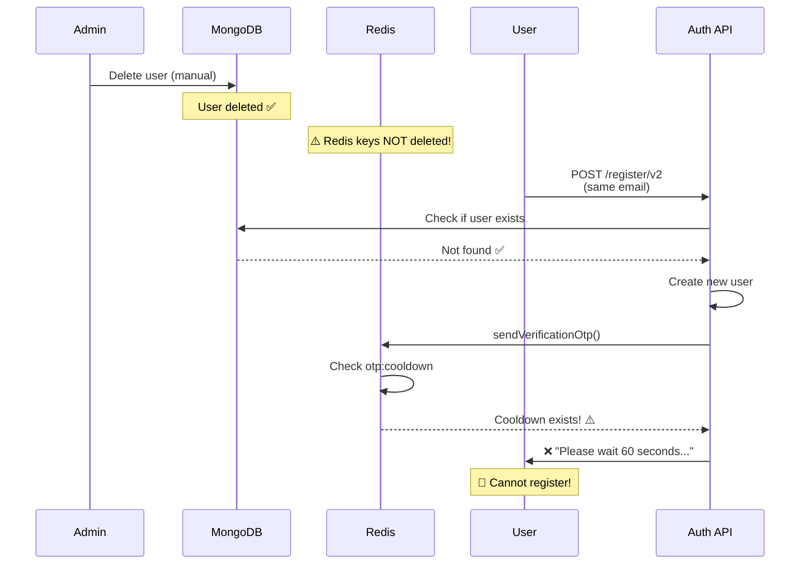

---

## 🔍 REDIS KEYS STATE DIAGRAM

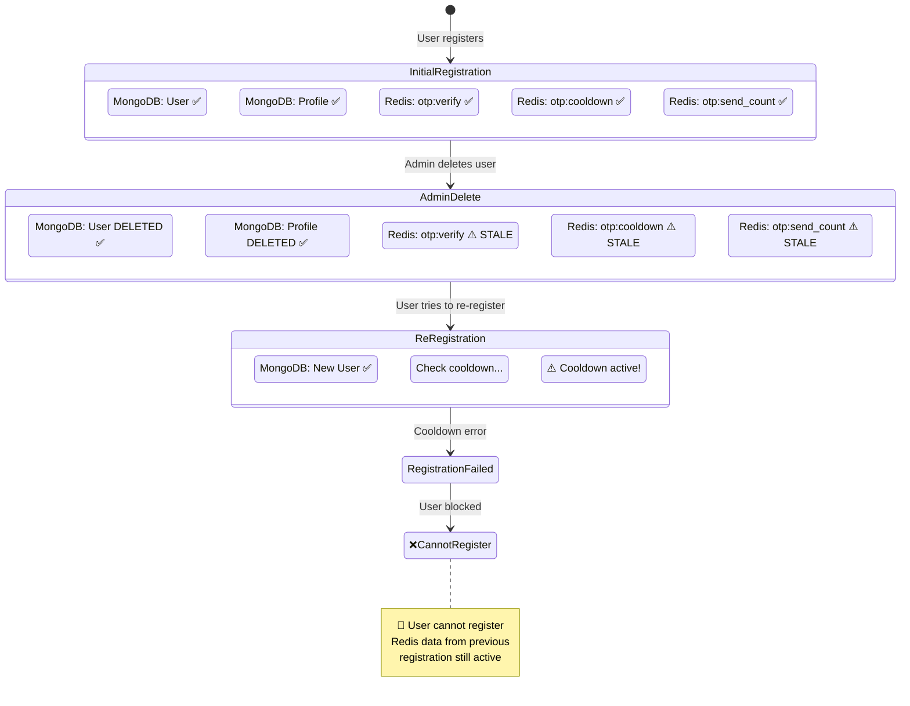

---

## ✅ SOLUTION FLOW DIAGRAM

### Solution 1: Clear Redis on Delete

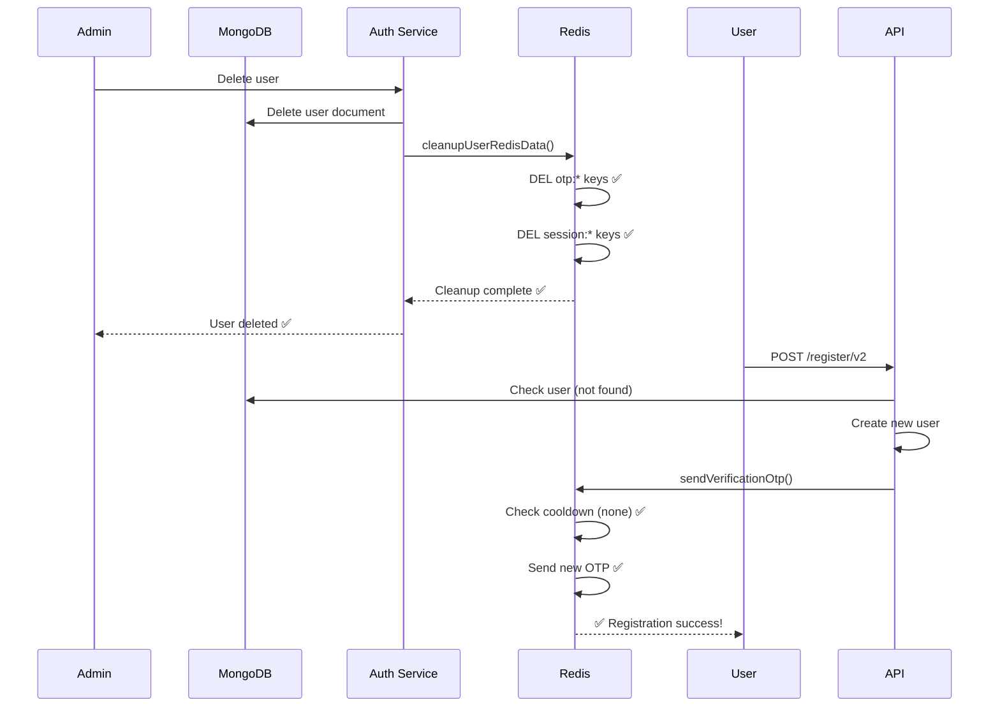

---

### Solution 2: Defensive Cleanup

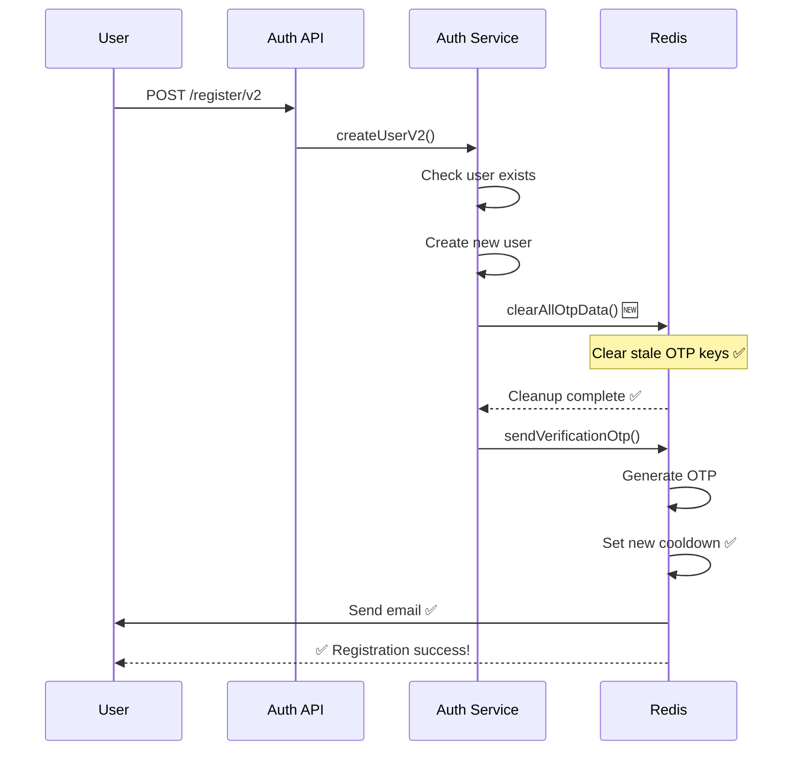

---

## ⏰ TIMELINE COMPARISON

```mermaid
gantt
    title Before Fix: Re-registration Blocked
    dateFormat ss
    axisFormat %ds

    section Initial Reg
    User registers       :0, 5s
    Redis keys set       :5s, 10s
    
    section Admin Delete
    Admin deletes user   :20s, 25s
    Redis NOT cleaned    :crit, 25s, 30s
    
    section Re-register Attempt
    User tries again     :40s, 45s
    Cooldown check       :45s, 50s
    ❌ BLOCKED           :crit, 50s, 55s
    
    section Wait Period
    Must wait cooldown   :55s, 60s
    Can finally register :65s, 70s
```

```mermaid
gantt
    title After Fix: Immediate Re-registration
    dateFormat ss
    axisFormat %ds

    section Initial Reg
    User registers       :0, 5s
    Redis keys set       :5s, 10s
    
    section Admin Delete
    Admin deletes user   :20s, 25s
    Redis CLEANED        :active, 25s, 30s
    
    section Re-register Attempt
    User tries again     :40s, 45s
    Clear stale data     :active, 45s, 50s
    Send new OTP         :active, 50s, 55s
    ✅ SUCCESS           :milestone, 55s, 60s
```

---

## 📊 REDIS KEY LIFECYCLE

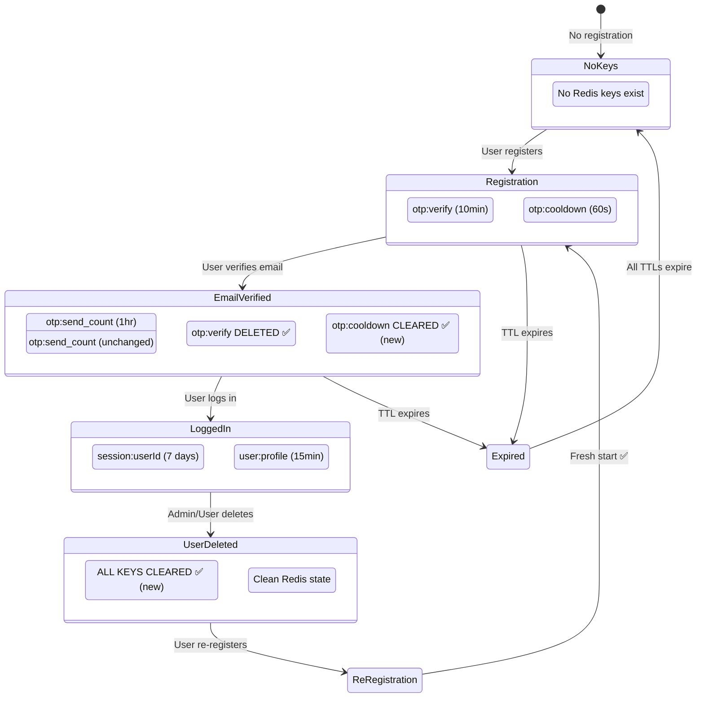

---

## 🎭 USER JOURNEY MAP

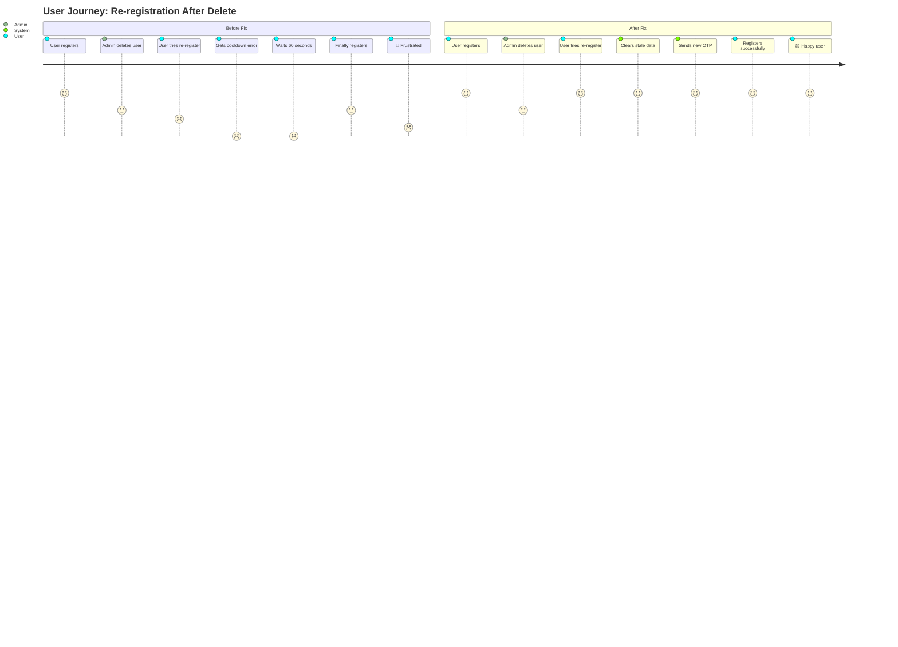

---

## 🔧 IMPLEMENTATION CHECKLIST

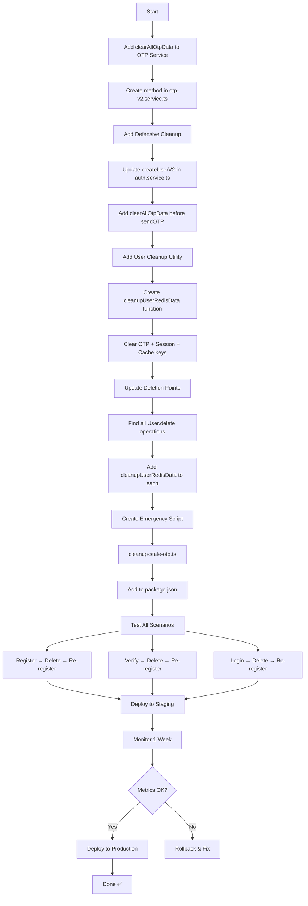

---

## 📈 METRICS TO TRACK

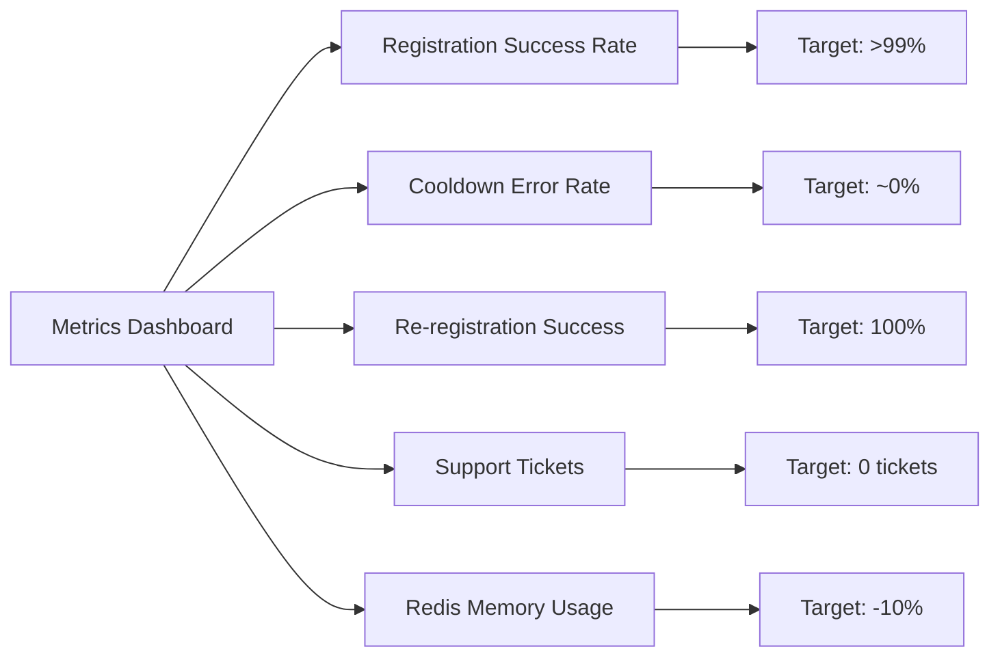

---

## 🎯 KEY SCENARIOS

### Scenario 1: Development Testing

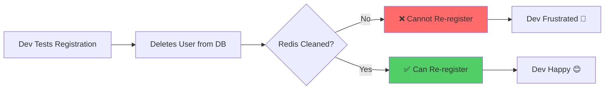

### Scenario 2: Production Admin Delete

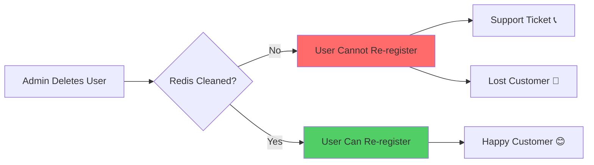

### Scenario 3: User Self-Delete (GDPR)

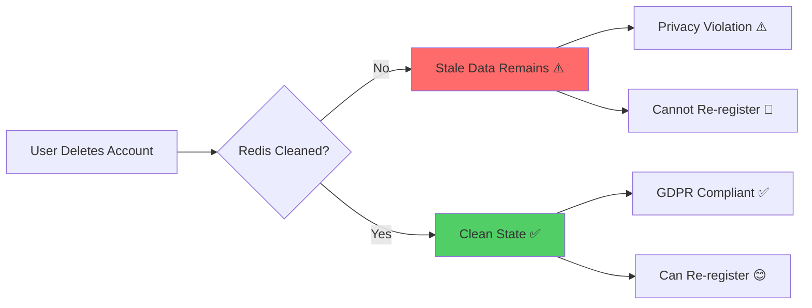

---

## 📊 BEFORE vs AFTER COMPARISON

### Registration Success Rate


### Support Tickets


---

## 🚨 EMERGENCY FIX OPTIONS

### Option 1: Manual Redis Cleanup

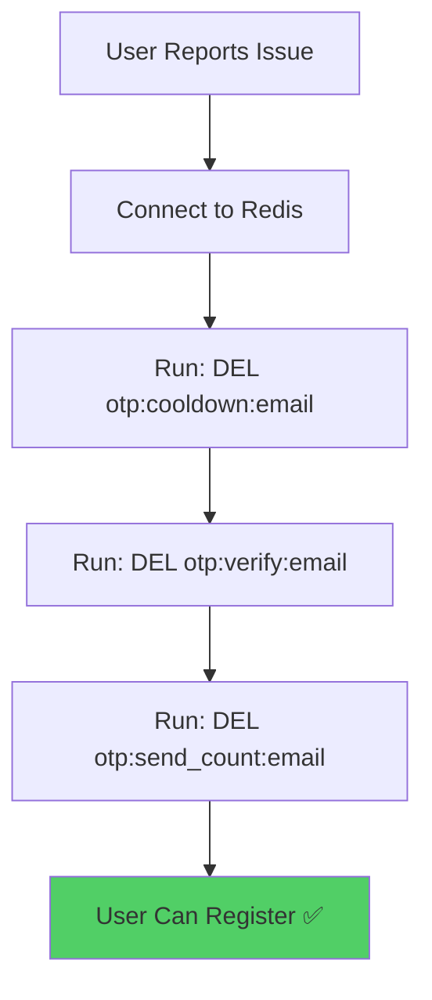

### Option 2: Wait for TTL

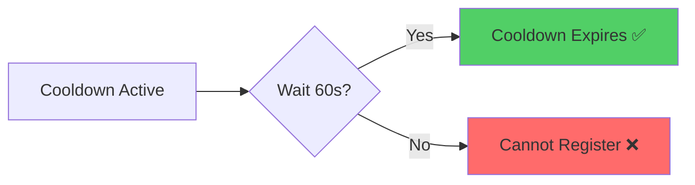

### Option 3: Use Different Email (Dev Only)

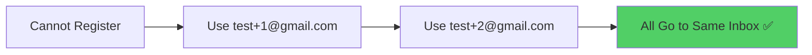

---

## 🎓 LESSONS LEARNED

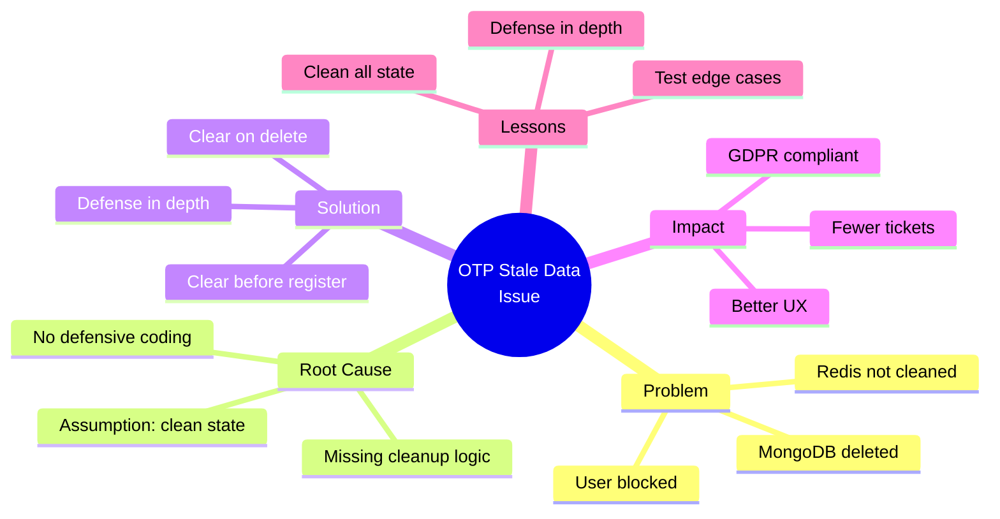

---

## 📝 QUICK REFERENCE

### Redis Key Patterns to Clear

```
✅ Clear These:
- otp:verify:{email}
- otp:cooldown:{email}
- otp:send_count:{email}
- otp:reset:{email}
- session:{userId}:*
- user:{userId}:profile

❌ Don't Clear:
- blacklist:* (shared)
- ratelimit:ip:* (shared)
- queue:* (BullMQ, shared)
```

### Code Snippets

```typescript
// Quick Fix (add to createUserV2)
await otpService.clearAllOtpData(user.email);
await otpService.sendVerificationOtp(user.email);

// Proper Fix (add to user deletion)
await cleanupUserRedisData(user._id, user.email);
await User.findByIdAndDelete(userId);
```

---

**Document Version**: 1.0  
**Last Updated**: 31-03-26  
**Related**: [OTP-STALE-DATA-ISSUE-RE-REGISTRATION-31-03-26.md](./OTP-STALE-DATA-ISSUE-RE-REGISTRATION-31-03-26.md)

---

-31-03-26
