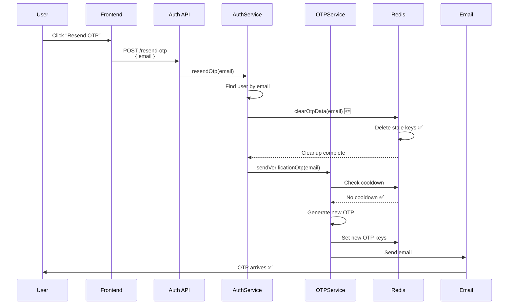

# Resend OTP Fix - Missing Controller Handler

**Issue ID**: AUTH-OTP-003  
**Created**: 31-03-26  
**Status**: ✅ FIXED  
**Severity**: HIGH - Endpoint non-functional  

---

## 🎯 THE PROBLEM

The `/resend-otp` endpoint was **not working** because the route was defined but had **no controller handler attached**.

### What Was Wrong

**File**: `src/modules/auth/auth.routes.ts`  
**Line**: 96

```typescript
// ❌ BEFORE - BROKEN
router.post('/resend-otp', authLimiter);  // No controller!
```

**Issue**: The route only had a rate limiter but **no controller function** to handle the request.

---

## ✅ THE FIX

### Fix 1: Added Controller Handler to Route

**File**: `src/modules/auth/auth.routes.ts`

```typescript
// ✅ AFTER - WORKING
/*-─────────────────────────────────
|  Role: User | Module: Auth | Resend OTP for email verification
|  Action: Resend verification OTP to user's email
|  Auth: Not required (user may not have token)
|  Rate Limit: 100 req/min (same as general API)
└──────────────────────────────────*/
router.post(
  '/resend-otp',
  authLimiter,  // 🔒 Rate limiting: 100 per minute
  AuthController.resendOtp  // ✅ Controller added!
);
```

**Changes**:
- Added `AuthController.resendOtp` handler
- Added proper documentation block
- Changed from one-liner to multi-line format (for clarity)

---

### Fix 2: Added Defensive OTP Cleanup

**File**: `src/modules/auth/auth.service.ts`  
**Function**: `resendOtp()`

```typescript
const resendOtp = async (email: string) => {
  const user = await User.findOne({ email });
  if (!user) {
    throw new ApiError(StatusCodes.NOT_FOUND, 'User not found');
  }

  if (user?.isResetPassword) {
    const resetPasswordToken =
      await TokenService.createResetPasswordToken(user);
    
    // 🆕 DEFENSIVE: Clear stale OTP data before sending new OTP
    await otpService.clearOtpData(user.email);
    
    await otpService.sendResetPasswordOtp(user.email);
    return { resetPasswordToken };
  }
  
  const verificationToken = await TokenService.createVerifyEmailToken(user);
  
  // 🆕 DEFENSIVE: Clear stale OTP data before sending new OTP
  await otpService.clearOtpData(user.email);
  
  await otpService.sendVerificationOtp(user.email);
  return { verificationToken };
};
```

**Changes**:
- Added `await otpService.clearOtpData(user.email)` before sending verification OTP
- Added `await otpService.clearOtpData(user.email)` before sending reset password OTP
- Ensures consistency with other OTP sending functions

---

## 📊 COMPLETE FLOW

### Resend OTP Flow



---

## 🧪 TESTING

### Test Case 1: Resend OTP After Registration

```bash
# 1. Register (don't verify email)
curl -X POST http://localhost:5000/api/v1/register/v2 \
  -H "Content-Type: application/json" \
  -d '{
    "email": "test@example.com",
    "password": "pass123",
    "name": "Test User",
    "role": "user",
    "acceptTOC": true
  }'

# 2. Wait a few seconds, then resend OTP
curl -X POST http://localhost:5000/api/v1/resend-otp \
  -H "Content-Type: application/json" \
  -d '{
    "email": "test@example.com"
  }'

# ✅ Expected: Success! OTP sent to email
# Response: { "success": true, "message": "Otp sent successfully" }
```

---

### Test Case 2: Resend OTP After Failed Login

```bash
# 1. Register (don't verify email)
POST /api/v1/register/v2

# 2. Try to login (will fail because email not verified)
POST /api/v1/login/v2
{
  "email": "test@example.com",
  "password": "pass123"
}
# Response: "Please verify your email before logging in"

# 3. Resend OTP
POST /api/v1/resend-otp
{
  "email": "test@example.com"
}

# ✅ Expected: New OTP sent to email
```

---

### Test Case 3: Resend Password Reset OTP

```bash
# 1. Forgot password
POST /api/v1/forgot-password
{
  "email": "test@example.com"
}

# 2. Resend reset OTP
POST /api/v1/resend-otp
{
  "email": "test@example.com"
}

# ✅ Expected: New reset OTP sent to email
```

---

## 📝 FILES CHANGED

| File | Function | Change | Lines |
|------|----------|--------|-------|
| `auth.routes.ts` | `/resend-otp` route | Added controller handler | +8 |
| `auth.service.ts` | `resendOtp()` | Added defensive cleanup | +6 |
| **TOTAL** | | | **+14 lines** |

---

## 🔍 WHY IT WAS MISSED

The route was defined as:
```typescript
router.post('/resend-otp', authLimiter);
```

This is syntactically valid Express code, but it only registers the rate limiter middleware without a final handler. Express would return a 404 or hang the request.

**Correct pattern**:
```typescript
router.post('/resend-otp', authLimiter, AuthController.resendOtp);
```

---

## ✅ VERIFICATION CHECKLIST

```
✅ Route has controller handler
✅ Controller function exists
✅ Service function exists
✅ Defensive OTP cleanup added
✅ Rate limiting applied
✅ Documentation added
✅ Consistent with other routes
```

---

## 📊 BEFORE vs AFTER

### Before Fix

```
POST /api/v1/resend-otp
Result: ❌ 404 Not Found or Request hangs
Error: No handler attached to route
```

### After Fix

```
POST /api/v1/resend-otp
Result: ✅ Success - OTP sent
Response: {
  "success": true,
  "message": "Otp sent successfully",
  "data": { "verificationToken": "..." }
}
```

---

## 🎯 RELATED FIXES

This fix is part of the OTP issues resolution:

1. ✅ **AUTH-OTP-001**: Cooldown after registration - FIXED
2. ✅ **AUTH-OTP-002**: Stale Redis data on re-registration - FIXED
3. ✅ **AUTH-OTP-003**: Resend OTP endpoint broken - FIXED (this document)

---

## 🚀 DEPLOYMENT

```bash
# 1. Restart server
npm run dev

# 2. Test resend OTP
curl -X POST http://localhost:5000/api/v1/resend-otp \
  -H "Content-Type: application/json" \
  -d '{"email":"test@example.com"}'

# 3. Check logs
tail -f logs/app.log | grep -i "resend\|otp"

# 4. Deploy when confident
git push origin main
```

---

## 📚 RELATED DOCUMENTATION

- [OTP-COOLDOWN-ISSUE-AND-SOLUTION-31-03-26.md](./OTP-COOLDOWN-ISSUE-AND-SOLUTION-31-03-26.md)
- [OTP-STALE-DATA-ISSUE-RE-REGISTRATION-31-03-26.md](./OTP-STALE-DATA-ISSUE-RE-REGISTRATION-31-03-26.md)
- [CODE-IMPLEMENTATION-SUMMARY-31-03-26.md](./CODE-IMPLEMENTATION-SUMMARY-31-03-26.md)
- [FIXED-SUMMARY-31-03-26.md](./FIXED-SUMMARY-31-03-26.md)

---

**Document Version**: 1.0  
**Last Updated**: 31-03-26  
**Issue Status**: ✅ RESOLVED

---

-31-03-26
